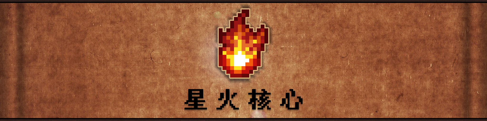

  

---

### 简介
星火核心是集成了刚体物理库，基岩版模型/动画加载器，kotlin状态机等多种实用内容到Minecraft的核心库，您可以使用它为任意MC实体搭载您想要的物理/渲染功能。

### 使用库
- [ode4j](https://github.com/tzaeschke/ode4j)

- [KStateMachine](https://github.com/KStateMachine/kstatemachine)

