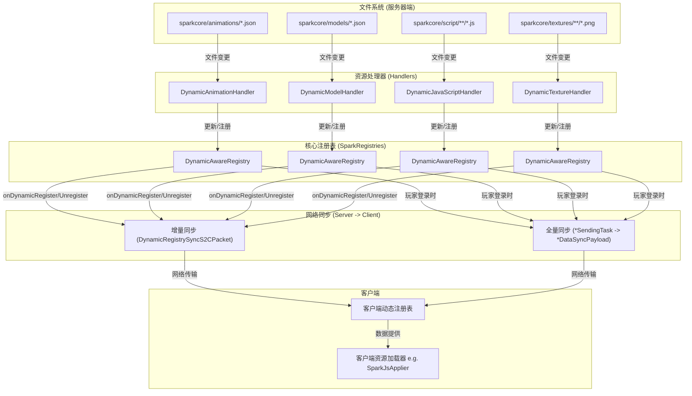

# Spark Core 动态资源系统：架构与实现指南

## 1. 架构概述

Spark Core 的动态资源系统经过重构，形成了一套统一、健壮且可扩展的架构。该系统允许在运行时动态地加载、更新和移除资源（如动画、模型、JS脚本、贴图），并自动将这些变更从服务器同步到所有连接的客户端。

### 1.1 核心设计理念

- **单一数据源**：所有动态资源都由 `cn.solarmoon.spark_core.registry.dynamic.DynamicAwareRegistry` 管理。这是系统中唯一可信的数据源，确保了数据的一致性。
- **事件驱动与热重载**：系统通过监听文件系统变更来自动更新资源，实现了无需重启游戏的热重载功能。
- **统一的同步机制**：无论是启动时的全量同步，还是运行时的增量同步，都遵循一套标准化的流程。

### 1.2 架构图



---

## 2. 核心组件详解

### 2.1 `IDynamicResourceHandler` (接口)
- **路径**: `cn.solarmoon.spark_core.resource.handler.IDynamicResourceHandler`
- **职责**: 定义了所有动态资源处理器的标准行为。
  - `onResourceAdded/Modified/Removed`: 监听并响应来自文件系统的变更事件。
  - `getDirectoryId()`: 返回处理器负责监控的子目录名（如 "animations", "script"）。
  - `initializeDefaultResources()`: 在模组启动时，从JAR包中提取默认资源到游戏目录。

### 2.2 `DynamicAwareRegistry<T>` (核心类)
- **路径**: `cn.solarmoon.spark_core.registry.dynamic.DynamicAwareRegistry`
- **职责**: 动态资源管理的核心。
  - **包装标准注册表**: 它包装了一个原版的 `Registry<T>`，并在此之上添加了动态管理功能。
  - **维护动态条目**: 内部使用 `ConcurrentHashMap` 存储动态加载的资源。
  - **统一访问接口**: 实现了 `Registry<T>` 接口，使得上层代码可以用相同的方式访问静态和动态资源。
  - **网络同步钩子**: 提供了 `onDynamicRegister` 和 `onDynamicUnregister` 回调。当动态条目发生变更时，这些回调被触发，用于启动增量网络同步。

### 2.3 `SparkRegistries` (静态入口)
- **路径**: `cn.solarmoon.spark_core.registry.common.SparkRegistries`
- **职责**:
  - **集中创建**: 创建并配置所有资源类型的 `DynamicAwareRegistry` 实例。
  - **绑定回调**: 将网络同步逻辑（发送 `DynamicRegistrySyncS2CPacket`）绑定到每个动态注册表的 `onDynamicRegister`/`onDynamicUnregister` 回调上。

### 2.4 网络同步组件

#### 2.4.1 增量同步 (`DynamicRegistrySyncS2CPacket`)
- **路径**: `cn.solarmoon.spark_core.resource.payload.registry.DynamicRegistrySyncS2CPacket`
- **触发时机**: 由 `DynamicAwareRegistry` 的回调在服务器端触发，当单个资源被添加、修改或删除时。
- **工作流程**:
  1. 服务器端的 `DynamicAwareRegistry` 回调被触发。
  2. 创建一个 `DynamicRegistrySyncS2CPacket`，其中包含：
     - `registryKey`: 目标注册表的ID。
     - `entryId`: 变更资源的ID。
     - `operationType`: `ADD` 或 `REMOVE`。
     - `entryData`: `ADD` 操作时，携带序列化后的资源数据。
  3. 包被发送到所有客户端。
  4. 客户端的 `handleInClient` 方法根据 `registryKey` 将操作分派给对应的处理函数，更新本地的 `DynamicAwareRegistry`。

#### 2.4.2 全量同步 (`*SendingTask` & `*DataSyncPayload`)
- **路径**:
  - `cn.solarmoon.spark_core.js.sync.JSScriptDataSendingTask`
  - `cn.solarmoon.spark_core.js.sync.JSScriptDataSyncPayload`
  - (其他资源类型类似)
- **触发时机**: 玩家登录，进入服务器配置阶段时。
- **工作流程**:
  1. NeoForge 触发 `ICustomConfigurationTask` (例如 `JSScriptDataSendingTask`)。
  2. `run()` 方法被调用，从对应的 `DynamicAwareRegistry` 中**获取所有条目**（包括静态和动态）。
  3. 将所有条目打包进一个大的全量同步包（例如 `JSScriptDataSyncPayload`）。
  4. 包被发送到正在登录的客户端。
  5. 客户端的 Payload 处理器接收数据，并用其**完全替换**本地 `DynamicAwareRegistry` 中的所有动态条目。
  6. 客户端向服务器发送一个 `AckPayload` (确认包)，服务器收到后完成该配置任务。

## 动画系统概览

Spark Core的动画系统采用**双层架构设计**，实现了元数据管理和数据存储的分离：

### 架构层次

```
┌─────────────────────── 元数据层 ───────────────────────┐
│ SparkRegistries.TYPED_ANIMATION (DynamicAwareRegistry) │
│ • 负责动画引用和ID管理                                   │
│ • 处理网络同步                                         │
│ • 提供统一的动画访问接口                                │
└─────────────────────── ↕ 数据访问 ─────────────────────┘
┌─────────────────────── 数据层 ─────────────────────────┐
│ OAnimationSet.ORIGINS (静态存储)                       │
│ • 存储实际的动画帧数据                                  │
│ • 管理骨骼变换信息                                     │
│ • 处理动画播放逻辑                                     │
└───────────────────────────────────────────────────────┘
```

## 核心组件分析

### 1. TypedAnimation（类型化动画）

**职责**：动画的"指针"和行为容器
- **位置**：`src/main/kotlin/cn/solarmoon/spark_core/animation/anim/play/TypedAnimation.kt`
- **核心属性**：
  ```kotlin
  class TypedAnimation(
      val index: AnimIndex,           // 动画索引，指向OAnimationSet中的位置
      private val provider: TypedAnimProvider  // 动画行为提供器
  )
  ```

**关键方法**：
```kotlin
// 检查动画是否存在
fun exist(animatable: IAnimatable<*>? = null): Boolean

// 创建动画实例  
fun create(animatable: IAnimatable<*>, fromAnimatable: Boolean = false): AnimInstance

// 播放动画
fun play(animatable: IAnimatable<*>, transTime: Int, fromAnimatable: Boolean = false)

// 网络同步
fun syncToClient(id: Int, transTime: Int, fromAnimatable: Boolean = false, exceptPlayer: ServerPlayer? = null)
```

### 2. DynamicAnimationHandler（动画文件处理器）

**职责**：监控动画文件变化并进行动态注册
- **位置**：`src/main/kotlin/cn/solarmoon/spark_core/resource/handler/DynamicAnimationHandler.kt`
- **监控路径**：`{游戏目录}/sparkcore/animations/`

**工作流程**：
```
文件变化事件 → processFile() → 解析JSON → 创建TypedAnimation → 
动态注册到TYPED_ANIMATION → 同步到OAnimationSet.ORIGINS → 网络同步到客户端
```

**关键处理逻辑**：
```kotlin
private fun processParsedResource(
    rootLocation: ResourceLocation,      // 动画集合的资源位置
    animationSet: OAnimationSet,        // 解析后的动画数据
    filePath: Path,                      // 文件路径
    isDeletion: Boolean,                 // 是否为删除操作
    syncToPlayers: Boolean               // 是否同步给玩家
)
```

### 3. OAnimationSet（动画集合）

**职责**：存储和管理实际的动画数据
- **位置**：`src/main/kotlin/cn/solarmoon/spark_core/animation/anim/origin/OAnimationSet.kt`

**数据访问优先级**：
```kotlin
companion object {
    // 静态存储：ResourceLocation -> OAnimationSet
    var ORIGINS = linkedMapOf<ResourceLocation, OAnimationSet>()
    
    fun get(res: ResourceLocation): OAnimationSet {
        // 1. 优先从动态注册表获取
        SparkRegistries.TYPED_ANIMATION?.let { registry ->
            registry.entrySet().forEach { entry ->
                val typedAnimation = entry.value
                if (typedAnimation.index.index == res) {
                    return ORIGINS[res] ?: EMPTY
                }
            }
        }
        // 2. 回退到静态ORIGINS
        return ORIGINS[res] ?: EMPTY
    }
}
```

## 资源Key格式规范

### 动画文件到ResourceLocation的映射

根据代码分析，动画资源的Key格式遵循以下规则：

| 层级 | 格式 | 示例 | 说明 |
|---|---|---|---|
| **动画文件路径** | `animations/{namespace}/{name}.json` | `animations/player/hand.json` | 物理文件位置 |
| **动画集合ResourceLocation** | `{namespace}:{name}` | `minecraft:player` | 对应一个动画文件的所有动画 |
| **具体动画名称** | JSON中的key | `"attack"`, `"animation.model.new"` | 文件内的具体动画 |
| **TypedAnimation资源Key** | `{namespace}:{path}/{animName}` | `minecraft:player/attack` | 动态注册表中的完整标识 |

### 实际示例解析

以`src/main/resources/animations/player/hand.json`为例：

```json
{
  "format_version": "1.8.0",
  "animations": {
    "attack": { /* 动画数据 */ }
  }
}
```

**对应的资源Key**：
- **动画集合**：`minecraft:player`
- **具体动画**：`attack`
- **TypedAnimation Key**：`minecraft:player/attack`
- **存储位置**：`OAnimationSet.ORIGINS["minecraft:player"]`

## 网络同步机制

### 双重同步策略

1. **增量同步**（热重载）
   ```kotlin
   // 文件变化 → Handler → Registry → Callback → 网络包
   DynamicRegistrySyncS2CPacket.createForTypedAnimationAdd(key.location(), value)
   ```

2. **全量同步**（玩家登录）
   ```kotlin
   // 新玩家 → Configuration Task → 批量数据传输
   AnimationDataSendingTask → AnimationDataSyncPayload
   ```

### 同步数据流

```
服务端文件变化
    ↓
DynamicAnimationHandler.processFile()
    ↓
TypedAnimation动态注册
    ↓
SparkRegistries.TYPED_ANIMATION.onDynamicRegister回调
    ↓
DynamicRegistrySyncS2CPacket发送给所有客户端
    ↓
客户端接收并更新本地注册表
    ↓
OAnimationSetSyncPayload同步实际动画数据
    ↓
客户端OAnimationSet.ORIGINS更新完成
```

## 依赖关系图分析

通过IDE图形工具分析得出的依赖关系：

### TypedAnimation的上游依赖（谁使用了它）

1. **动画控制器**：`AnimController.setAnimation()`
2. **网络同步**：`DynamicRegistrySyncS2CPacket`
3. **状态机管理**：`AnimStateMachineManager`
4. **API接口**：`SparkCustomnpcApi.playTypedAnimation()`
5. **事件系统**：`ChangePresetAnimEvent`

### TypedAnimation的下游依赖（它使用了什么）

1. **注册表访问**：`SparkRegistries.TYPED_ANIMATION.getId(this)`
2. **数据获取**：`OAnimationSet.get(index.index).getAnimation(index.name)`
3. **动画实例创建**：`AnimInstance.create()`
4. **网络同步**：`PacketDistributor.sendToAllPlayers()`

## 最佳实践建议

### 1. 新资源类型实现指南

基于动画系统的成熟架构，新资源类型应该：

```kotlin
// 1. 定义资源数据类（对应OAnimationSet）
data class ONewResource(val data: Map<String, Any>)

// 2. 定义类型化资源类（对应TypedAnimation）  
class TypedNewResource(val index: NewResourceIndex, val provider: NewResourceProvider)

// 3. 创建动态注册表
val NEW_RESOURCE = DynamicAwareRegistry<TypedNewResource>()

// 4. 实现文件处理器
class DynamicNewResourceHandler : IDynamicResourceHandler

// 5. 设置静态存储
companion object {
    var ORIGINS = linkedMapOf<ResourceLocation, ONewResource>()
}
```

### 2. 资源Key命名约定

- **文件路径**：`resources/{resource_type}/{namespace}/{specific_name}.json`
- **集合Key**：`{namespace}:{specific_name}`  
- **具体项Key**：JSON文件内的键名
- **类型化资源Key**：`{namespace}:{specific_name}/{item_name}`

### 3. 线程安全考虑

动画系统使用了以下线程安全措施：
- `ConcurrentHashMap`用于动态条目存储
- `ReadWriteLock`保护注册表操作
- `@Volatile`标记共享变量
- 服务端/客户端上下文检查避免错误的网络包发送

这个动画资源管理系统为其他资源类型的实现提供了完整的参考模式，展示了如何在保持性能的同时实现动态资源管理和网络同步。 
---

## 3. 【指南】如何添加新的动态资源类型

本节将以添加一个新的动态资源类型——`Shader`——为例，详细说明所需步骤。

### 假设:
- 新资源的数据类为 `OShader`。
- `OShader` 有一个 `StreamCodec` 用于网络序列化。
- 资源文件存放在 `sparkcore/shaders/` 目录下，以 `.glsl` 结尾。

### 第1步：创建数据类 (`OShader.kt`)

创建一个代表你资源的数据类，并为其实现网络序列化。

```kotlin
// src/main/kotlin/cn/solarmoon/spark_core/shader/OShader.kt
package cn.solarmoon.spark_core.shader

import net.minecraft.network.FriendlyByteBuf
import net.minecraft.network.codec.StreamCodec

data class OShader(
    val shaderName: String,
    val vertexShader: String,
    val fragmentShader: String
) {
    companion object {
        @JvmField
        val STREAM_CODEC: StreamCodec<FriendlyByteBuf, OShader> = StreamCodec.of(
            { buf, shader ->
                buf.writeUtf(shader.shaderName)
                buf.writeUtf(shader.vertexShader)
                buf.writeUtf(shader.fragmentShader)
            },
            { buf ->
                OShader(
                    buf.readUtf(),
                    buf.readUtf(),
                    buf.readUtf()
                )
            }
        )
    }
}
```

### 第2步：创建动态注册表

在 `SparkRegistries.kt` 中，为新资源类型添加一个新的 `DynamicAwareRegistry`。

```kotlin
// src/main/kotlin/cn/solarmoon/spark_core/registry/common/SparkRegistries.kt
object SparkRegistries {
    // ... 其他注册表 ...

    @JvmStatic
    val DYNAMIC_SHADERS =
        (SparkCore.REGISTER.registry<OShader>()
            .id("dynamic_shaders") // 注册表ID
            .valueType(OShader::class)
            .build { it.sync(true).create() } as? DynamicAwareRegistry<OShader>)
            ?.apply {
                // 绑定增量同步回调
                this.onDynamicRegister = { key, value ->
                    // ... (参考其他注册表的实现，发送 DynamicRegistrySyncS2CPacket.createForShaderAdd)
                }
                this.onDynamicUnregister = { key, value ->
                    // ... (参考其他注册表的实现，调用 DynamicRegistrySyncS2CPacket.syncShaderRemovalToClients)
                }
            } ?: throw IllegalStateException("DYNAMIC_SHADERS registry failed to cast")
}
```

### 第3步：创建资源处理器 (`DynamicShaderHandler.kt`)

创建一个新的 Handler 来处理文件系统中的 `Shader` 文件。

```kotlin
// src/main/kotlin/cn/solarmoon/spark_core/resource/handler/DynamicShaderHandler.kt
package cn.solarmoon.spark_core.resource.handler

import cn.solarmoon.spark_core.shader.OShader
// ... 其他 imports ...

@AutoRegisterHandler
class DynamicShaderHandler(
    private val shaderRegistry: DynamicAwareRegistry<OShader>
) : IDynamicResourceHandler {

    override fun getDirectoryId(): String = "shaders"

    override fun onResourceAdded(file: Path) {
        if (!file.toString().endsWith(".glsl")) return
        
        // 1. 从文件解析出 OShader 对象
        val shaderName = file.fileName.toString().removeSuffix(".glsl")
        val content = file.readText()
        // (你需要实现一个逻辑来分割顶点和片段着色器)
        val (vertex, fragment) = parseShaderContent(content)
        val oShader = OShader(shaderName, vertex, fragment)

        // 2. 创建 ResourceLocation
        val location = ResourceLocation(SparkCore.MOD_ID, shaderName)

        // 3. 注册到动态注册表（这将自动触发增量同步）
        shaderRegistry.registerDynamic(location, oShader, replace = true)
        SparkCore.LOGGER.info("Dynamically registered shader: {}", location)
    }

    override fun onResourceRemoved(file: Path) {
        if (!file.toString().endsWith(".glsl")) return
        val shaderName = file.fileName.toString().removeSuffix(".glsl")
        val location = ResourceLocation(SparkCore.MOD_ID, shaderName)
        shaderRegistry.unregisterDynamic(location)
        SparkCore.LOGGER.info("Dynamically unregistered shader: {}", location)
    }

    override fun onResourceModified(file: Path) {
        onResourceAdded(file) // 修改可以简化为重新添加
    }
    
    // ... 实现 getDirectoryPath, getResourceType, initializeDefaultResources ...
}
```

### 第4步：创建全量与增量同步逻辑

#### 4.1 增量同步 (`DynamicRegistrySyncS2CPacket.kt`)

在 `DynamicRegistrySyncS2CPacket.kt` 中添加对 `OShader` 的支持。

1.  **添加创建方法**:
    ```kotlin
    fun createForShaderAdd(id: ResourceLocation, shader: OShader): DynamicRegistrySyncS2CPacket {
        val buf = FriendlyByteBuf(Unpooled.buffer())
        OShader.STREAM_CODEC.encode(buf, shader)
        // ... (省略了 ByteArray 转换)
        return DynamicRegistrySyncS2CPacket(SparkRegistries.DYNAMIC_SHADERS.key(), id, OperationType.ADD, bytes)
    }
    ```

2.  **添加移除方法**:
    ```kotlin
    fun syncShaderRemovalToClients(id: ResourceLocation) {
        // ... (参考 syncTextureRemovalToClients)
    }
    ```

3.  **在 `handleInClient` 中添加处理分支**:
    ```kotlin
    when (packet.registryKey) {
        // ...
        SparkRegistries.DYNAMIC_SHADERS.key() -> handleShaderSync(packet)
    }
    ```

4.  **实现 `handleShaderSync`**:
    ```kotlin
    private fun handleShaderSync(packet: DynamicRegistrySyncS2CPacket) {
        val dynamicRegistry = SparkRegistries.DYNAMIC_SHADERS
        when (packet.operationType) {
            OperationType.ADD -> {
                // ... (反序列化并调用 dynamicRegistry.registerDynamic)
            }
            OperationType.REMOVE -> {
                // ... (调用 dynamicRegistry.unregisterDynamic)
            }
        }
    }
    ```

#### 4.2 全量同步 (`ShaderDataSendingTask.kt` & `ShaderDataSyncPayload.kt`)

1.  创建 `ShaderDataSyncPayload.kt`，用于携带所有 `OShader` 数据的列表。
2.  创建 `ShaderDataSendingTask.kt`，实现 `ICustomConfigurationTask`。
    -   在 `run()` 方法中，从 `SparkRegistries.DYNAMIC_SHADERS` 获取所有条目，创建 `ShaderDataSyncPayload` 并发送。
3.  在 `SparkPayloadRegister.kt` 中注册新的 `SendingTask`。

### 第5步：完成！

完成以上步骤后，你就为 `Shader` 资源实现了一套完整的动态管理系统，它将无缝地集成到现有架构中，并自动获得热重载和网络同步功能。 