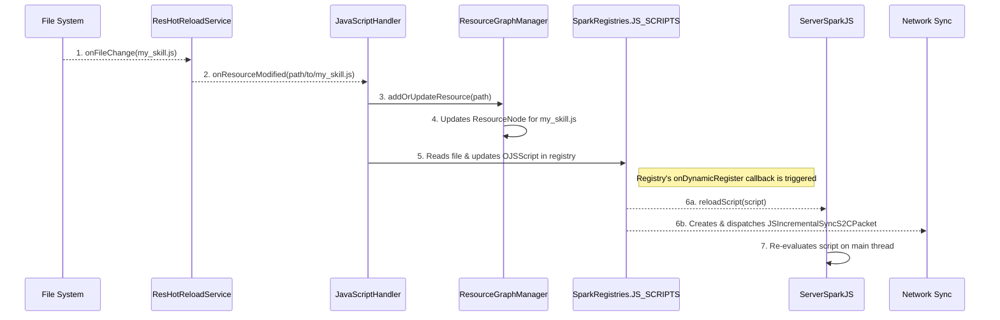

# SparkCore JavaScript 热重载系统实现

## 1. 概述

SparkCore 的 JavaScript 热重载功能允许开发者在游戏运行时动态地添加、修改或删除脚本文件，并立即在游戏中看到效果，无需重启。该系统基于新的资源图架构，实现了高效、稳定和线程安全的实时更新。

## 2. 核心组件

- **`ResHotReloadService`**: 底层的文件监控服务，使用 `commons-io.monitor` 库监听文件系统的变化（创建、修改、删除）。
- **`JavaScriptHandler`**: 实现了 `IResourceHandler` 接口，是JS资源的专属处理器。它负责响应 `ResHotReloadService` 的事件，并与资源图系统交互。
- **`ResourceGraphManager`**: 资源图的核心，负责管理JS脚本作为图中的一个节点，包括其路径、元数据和依赖关系。
- **`DynamicAwareRegistry` (`SparkRegistries.JS_SCRIPTS`)**: 动态注册表，存储 `OJSScript` 对象。它的变更会自动触发网络同步和脚本重载回调。
- **`ServerSparkJS` / `ClientSparkJS`**: JS引擎的执行器，提供了线程安全的 `reloadScript` 和 `unloadScript` 方法来应用变更。

## 3. 热重载工作流程

当一个JS文件被修改时，会触发以下完整的事件链：



1.  **文件监控**: `ResHotReloadService` 检测到 `my_skill.js` 文件被修改。
2.  **处理器响应**: 它调用已注册的 `JavaScriptHandler` 的 `onResourceModified` 方法，并传入文件路径。
3.  **资源图更新**: `JavaScriptHandler` 调用 `ResourceGraphManager.addOrUpdateResource()`。`ResourceGraphManager` 负责更新图中代表该脚本的 `ResourceNode` 的元数据和属性，但它不关心脚本的具体内容。
4.  **注册表更新**: `JavaScriptHandler` 读取更新后的脚本文件内容，创建一个新的 `OJSScript` 对象，并用它更新 `SparkRegistries.JS_SCRIPTS` 中对应的条目。
5.  **触发回调**: `DynamicAwareRegistry` 的 `onDynamicRegister` 回调被触发。这个回调是实现热重载的关键，它会并行执行两个操作：
    a.  **服务端执行**: 调用 `ServerSparkJS.instance.reloadScript()`。
    b.  **网络同步**: 创建一个 `JSIncrementalSyncS2CPacket` 并将其广播给所有客户端。
6.  **脚本重载**: `ServerSparkJS` 在服务器主线程上安全地重新执行该脚本，应用新的逻辑。
7.  **客户端同步**: 客户端接收到增量同步包，更新自己的注册表，并同样调用 `ClientSparkJS` 来重载脚本。

## 4. 关键实现细节

### 4.1 线程安全
- **问题**: 文件监控事件在独立的I/O线程中发生，而JS引擎（Rhino）和游戏逻辑（Minecraft）都不是线程安全的。
- **解决**: `JavaScriptHandler` 的工作是轻量级的（调用`RGM`和更新注册表），这些操作本身是线程安全的。真正的脚本执行逻辑被委托给了 `ServerSparkJS` 和 `ClientSparkJS`，它们内部使用 `server.execute()` 和 `minecraft.execute()` 将 `eval` 操作切换到游戏主线程或渲染线程，从而保证了线程安全。

### 4.2 状态管理与清理
- **问题**: 重载脚本时，如何清理旧脚本定义的对象或监听器，以避免内存泄漏或逻辑冲突？
- **解决**: `JSApi` 接口提供了 `onReload()` 方法。在 `reloadScript` 期间，会先调用对应API模块的 `onReload()`，开发者应在此方法中实现清理逻辑（如清除旧的技能定义、移除事件监听器等），然后再执行新的脚本。

```kotlin
// 在 ServerSparkJS.reloadScript 中
val api = JSApi.ALL[script.apiId]
api?.onReload() // 先调用清理钩子
executeScript(script) // 再执行新脚本
api?.onLoad()
```

### 4.3 数据一致性
- **问题**: 如何确保所有客户端和服务端的脚本版本始终一致？
- **解决**: 服务端的 `DynamicAwareRegistry` 是唯一的数据权威来源。任何对注册表的修改都会自动触发网络同步事件，确保变更被可靠地分发到所有客户端，从而维护了整个系统的数据一致性。

## 5. 总结

SparkCore 的 JavaScript 热重载系统是一个高度解耦且事件驱动的系统。它通过将文件监控、资源图管理、注册表更新和脚本执行等职责分离到不同的组件中，实现了健壮可靠的实时更新功能。这个系统不仅提升了开发效率，也为动态内容更新和在线修复提供了强大的技术支持。 