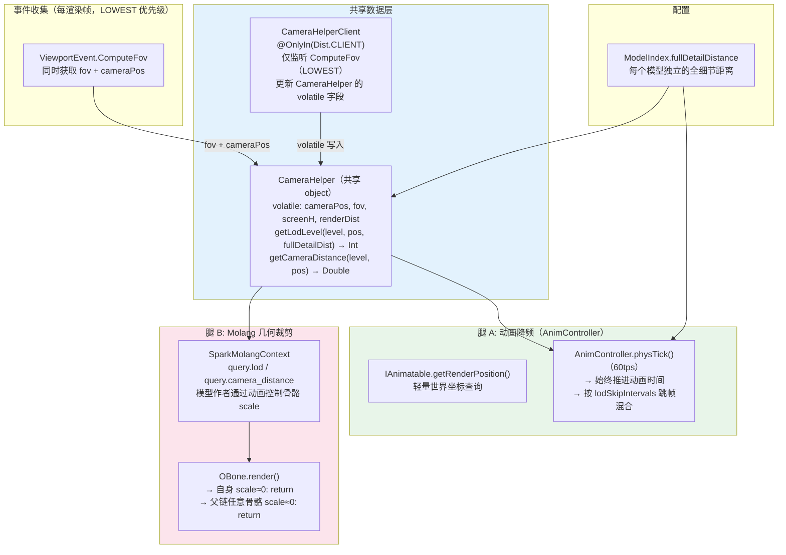

# LOD 系统设计文档

**生成日期:** 2026-07-13 · **所属项目:** Spark-Core

## 概述

为 Spark-Core 基于 Bedrock 模型的渲染管线增加 LOD（Level of Detail）支持，降低远距离模型的渲染与动画计算压力。

设计原则：
- **两条腿走路**：动画降频（减少 CPU 混合开销）+ Molang 驱动几何裁剪（减少 GPU 顶点写入）
- **服务端安全**：查询方法通过 `Level` 参数做客户端/服务端分流，无需 `Minecraft.getInstance()`
- **FOV 感知**：LOD 阈值根据相机 FOV 动态修正，瞄准镜放大时自动提升远处物体的细节等级
- **每模型可配置**：通过 `ModelIndex.fullDetailDistance` 参数为不同尺寸的模型设定不同的全细节距离

## 架构总览



## 一、CameraHelper — 共享数据层

### 设计要点

- **非 `@OnlyIn`**：`CameraHelper` 本身是共享 object，服务端和客户端均存在
- **volatile 字段**：客户端 `CameraHelperClient` 写入，其他线程（物理线程、渲染线程）读取
- **`level` 参数分流**：所有查询方法第一个参数为 `Level`，服务端直接返回安全默认值（LOD=0）
- **FOV 修正**：以 70° 为基准 FOV，瞄准镜放大时 `effectiveDist` 等比缩小，LOD 自动降级
- **`screenHeight` 字段**：供 `OCube.getCurrentThresholdSq()` 的像素尺寸面剔除使用（与 LOD 的 FOV 修正是独立功能）

### API

```kotlin
object CameraHelper {
    @Volatile var cameraPos: Vec3
    @Volatile var fov: Double
    @Volatile var screenHeight: Int
    @Volatile var renderDistance: Double

    fun getLodLevel(level: Level, worldPos: Vec3, fullDetailDistance: Double): Int
    fun getCameraDistance(level: Level, worldPos: Vec3): Double
}
```

### FOV 修正公式

```
effectiveDist = actualDist × tan(currentFov / 2) / tan(70° / 2)
ratio = effectiveDist / fullDetailDistance

LOD = 0  when ratio < 1.0    （全细节距离内）
      1  when ratio < 2.0    （屏幕占比减半）
      2  when ratio < 4.0    （屏幕占比 1/4）
      3  otherwise           （更远）
```

| 场景 | FOV | fullDetailDist | 实际距离 | ratio | LOD |
|------|-----|---------------|---------|-------|-----|
| 默认视角 | 70° | 24m | 10m | 0.42 | **0** |
| 默认视角 | 70° | 24m | 30m | 1.25 | **1** |
| 默认视角 | 70° | 24m | 50m | 2.08 | **2** |
| 8× 炮镜 | 8.75° | 12m | 40m | 0.36 | **0** |
| 大车体 | 70° | 24m | 30m | 1.25 | **1** |
| 小螺栓 | 70° | 4m | 30m | 7.5 | **3** |

### CameraHelperClient — 客户端更新器

```kotlin
@OnlyIn(Dist.CLIENT)
@EventBusSubscriber(modid = SparkCore.MOD_ID, bus = EventBusSubscriber.Bus.GAME, value = [Dist.CLIENT])
object CameraHelperClient {
    @SubscribeEvent(priority = EventPriority.LOWEST)
    fun onComputeFov(event: ViewportEvent.ComputeFov) {
        CameraHelper.fov = event.fov                          // 含其他模组修改后的最终值
        CameraHelper.cameraPos = event.camera.getPosition()   // 从同一事件取相机位置
        val mc = Minecraft.getInstance()
        CameraHelper.screenHeight = mc.window.height
        CameraHelper.renderDistance = mc.gameRenderer.renderDistance.toDouble()
    }
}
```

- **事件选择**：`ComputeFov` 携带 `Camera` 对象（`event.camera.getPosition()`），可同时获取 FOV 和相机位置，减少事件监听数量
- **LOWEST 优先级**：确保取到包含其他模组（如枪械模组的瞄准镜 FOV 修改）的最终值
- **一 tick 延迟**：物理线程在下一次步进（~16.67ms）后才读取这些 volatile 值，LOD 切换存在至多一 tick 延迟。这在 LOD 场景下可接受
- **FovHelper 删除**：现有 `FovHelper` 的 `fov`/`height` 字段并入 `CameraHelper`，`OCube.getCurrentThresholdSq()` 改用 `CameraHelper` 数据源

---

## 二、ModelIndex — 全细节距离

```kotlin
data class ModelIndex @JvmOverloads constructor(
    val type: String,
    val location: ResourceLocation,
    val fullDetailDistance: Double = 24.0   // 默认 24m
)
```

- **`fullDetailDistance`**：物体在此距离以内以 LOD 0（全细节）渲染
- **默认 12m**：适合多数中型模型，通过 `@JvmOverloads` 兼容已有构造调用
- **大物体设大值**：如车体 24m；**小物体设小值**：如螺栓 4m

---

## 三、腿 A：动画降频

### 位置

`AnimController.physTick()`（物理线程，60tps）。当前驱动链：

```
PhysicsLevel.prePhysicsTick()  [物理线程 60tps]
  └→ PhysicsEntityTickEvent(MMPartEntity)
       └→ AnimApplier.physTick()
            └→ MMPartEntity.animController.physTick()
                 └→ SubPart.animController.physTick()   ← 降频在此插入
```

### 降频策略

始终推进动画时间（保证进度正确），按 LOD 等级跳帧执行骨骼混合（`blendBone`）：

| LOD | 跳过 tick 数 | 混合频率 | 说明 |
|-----|------------|---------|------|
| 0 | 0 | 60Hz（每 tick） | 流畅 |
| 1 | 1 | 30Hz（每 2 tick） | 轻微降频 |
| 2 | 11 | 5Hz（每 12 tick） | 明显降频 |
| 3 | 29 | 2Hz（每 30 tick） | 半秒一次，远距离已不可见 |

### 伪码

```kotlin
// AnimController.kt

companion object {
    val lodSkipIntervals = intArrayOf(0, 1, 11, 29)
}

fun physTick() {
    if (!isPlayingAnim) return

    // 始终推进动画时间
    layers.values.forEach { it.physicsTick(overallSpeed) }

    // 计算 LOD 等级
    val pos = animatable.getRenderPosition(0)
    val fullDetailDist = animatable.modelController.model?.index?.fullDetailDistance ?: 24.0
    lodLevel = CameraHelper.getLodLevel(animatable.animLevel ?: return, pos, fullDetailDist)

    // LOD 降频
    val skipInterval = lodSkipIntervals[lodLevel.coerceIn(0, 3)]
    if (skipInterval > 0 && ++skipCounter % (skipInterval + 1) != 0) return

    // 执行骨骼混合
    animatable.modelController.model?.let { model ->
        for (bonePose in model.pose.bonePoseList) {
            bonePose.updateInternal(blendBone(bonePose.name))
        }
    }
}
```

### IAnimatable 新增

```kotlin
/**
 * 获取用于 LOD 判断的轻量世界坐标。
 * 默认实现从 [getWorldPositionMatrix] 提取 translation（构建完整 Matrix4f），
 * GC 开销较大。子类应覆写为字段直读以降低物理线程压力。
 */
fun getRenderPosition(partialTicks: Number = 0): Vec3 {
    val mat = getWorldPositionMatrix(partialTicks)
    return Vec3(mat.m30().toDouble(), mat.m31().toDouble(), mat.m32().toDouble())
}
```

子类覆写示例（`SubPart`）：

```java
@Override
public Vec3 getRenderPosition(Number partialTicks) {
    var t = transform.getTranslation();  // JME Vector3f，字段直读，零分配
    return new Vec3(t.x, t.y, t.z);
}
```

---

## 四、腿 B：Molang 几何裁剪

### Molang 变量

在 `SparkMolangContext` 中新增：

| 变量 | 返回值 | 说明 |
|------|--------|------|
| `query.lod` | 0-3 | 当前 LOD 等级，服务端返回 0 |
| `query.camera_distance` | double（米） | 相机距离，服务端返回 0 |

模型作者在动画 JSON 中使用：

```json
{
    "bones": {
        "decorative_bolt": {
            "scale": "query.lod > 1 ? 0 : 1"
        }
    }
}
```

### 渲染短路

在 `OBone.render()` 入口处，对 scale≈0 的骨骼及其子树跳过全部渲染管线：

```kotlin
fun OBone.render(pose, poseStack, buffer, ...) {
    // 自身 scale=0 → 跳过
    val selfScale = pose.getBonePose(name)?.getLocalScale(partialTick) ?: return
    if (isScaleNearZero(selfScale)) return

    // 任一父骨骼 scale=0 → 整条子树跳过
    var parent: OBone? = getParent()
    while (parent != null) {
        val parentScale = pose.getBonePose(parent.name)?.getLocalScale(partialTick)
        if (parentScale != null && isScaleNearZero(parentScale)) return
        parent = parent.getParent()
    }

    // ... 原有 applyTransformWithParents + 渲染
}
```

**收益**：当 Molang 将骨骼 scale 设为 0 时，不仅跳过 cube 渲染，连 `applyTransformWithParents` 的父链矩阵遍历也一并跳过。子骨骼通过父链检测自动被裁剪。

父链遍历在渲染线程执行，典型层次深度 2-5（Minecraft 模型骨骼层级较浅），单次遍历开销远低于完整渲染管线。对 30+ 骨骼的模型，自底向上遍历的总开销仍在可接受范围内。

---

## 五、变更清单

| # | 文件 | 项目 | 变更 |
|---|------|------|------|
| 1 | **新增** `CameraHelper.kt` | Spark-Core | 共享 volatile 数据 + LOD 查询方法（`level` 为第一参数） |
| 2 | **新增** `CameraHelperClient.kt` | Spark-Core | `@OnlyIn` object，LOWEST 优先级监听相机事件 |
| 3 | **删除** `FovHelper.kt` | Spark-Core | 字段并入 `CameraHelper` |
| 4 | `OCube.kt` | Spark-Core | `getCurrentThresholdSq()` 改用 `CameraHelper` |
| 5 | `ModelIndex.kt` | Spark-Core | +`fullDetailDistance: Double = 24.0` |
| 6 | `IAnimatable.kt` | Spark-Core | +`getRenderPosition()` |
| 7 | `AnimController.kt` | Spark-Core | +`lodLevel`, +`skipCounter`, `physTick()` 降频 |
| 8 | `SparkMolangContext.java` | Spark-Core | +`queryLod()`, +`queryCameraDistance()` |
| 9 | `ModelRenderHelper.kt` | Spark-Core | `OBone.render()` 入口 scale≈0 短路 |

---

## 六、扩展点

- **动画 LOD 更细粒度**：可在 `OBone` 增加 `lodMinLevel` 字段（模型 JSON 中标注），在渲染入口按骨骼过滤
- **模型文件切换**：可通过 `ModelController.setModel()` 运行时切换不同精度的 `.geo.json`，需配合 `SubPartAttr.bonesCache` 失效机制
- **更激进的降频**：当前 LOD 3 最低 2Hz，如需更低可调整 `lodSkipIntervals` 数组
