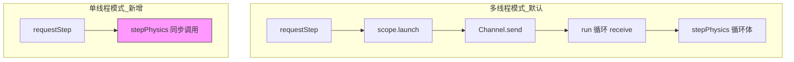
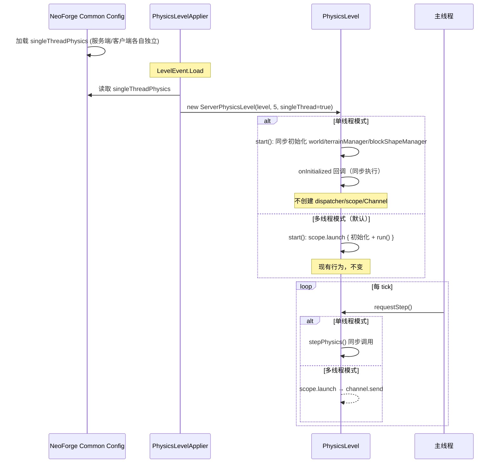

# 物理单线程模式开关——设计与实施计划

> **状态**: 设计评审中 · **创建**: 2026-07-09 · **修订**: 2026-07-09\
> **目标版本**: Spark-Core 1.x · **涉及仓库**: Spark-Core（配置系统 + PhysicsLevel 改造）

***

## 目录

1. [背景与动机](#1-背景与动机)
2. [当前架构](#2-当前架构)
3. [问题分析](#3-问题分析)
4. [方案设计](#4-方案设计)
5. [配置系统设计](#5-配置系统设计)
6. [PhysicsLevel 改造](#6-physicslevel-改造)
7. [入口适配](#7-入口适配)
8. [实施计划](#8-实施计划)
9. [风险与对策](#9-风险与对策)
10. [不变部分清单](#10-不变部分清单)

***

## 1. 背景与动机

### 背景

Spark-Core 的物理系统采用**双线程架构**：主线程负责 MC 数据同步和地形管理，物理线程（独立协程）负责 JME Bullet `world.update()` 循环。线程间通过 `Channel` + `Channel.CONFLATED` 单向通信，`StateFlow` 防重复触发。

这种设计在以下场景有明确收益：
- 高负载服务端（多载具 + 多投射物 + 大量地形刚体）
- 跑图时地形构建压力大，物理线程独立运行不拖慢主线程 20tps

但在以下场景存在代价：
- 调试物理问题时堆栈跨线程，难以追踪
- 怀疑多线程兼容性问题时无法快速隔离
- 开发阶段崩溃信息被协程包装，不够直观
- 低负载单人场景下，线程调度和同步完全是额外开销

### 动机

提供一个**配置驱动的单线程模式开关**，服务端和客户端各自独立控制：
- 调试物理 bug 时切换到单线程，获得完整同步堆栈
- 排查与其他 mod 的兼容性问题时，快速隔离线程安全因素
- 低负载场景可选用单线程以降低延迟和系统开销
- 默认保持现有多线程行为，不影响现有用户

***

## 2. 当前架构

```
主线程 (20tps)                           物理线程 (独立协程)
─────────────                           ────────────────
requestStep()                           run() 循环
  ├─ 收集实体列表                         ├─ 等待 physicsTickChannel
  ├─ 同步世界快照 (transform)             ├─ repeat(dynamicRepeat):
  ├─ 更新地形 (terrainManager)           │    prePhysicsTick 回调
  ├─ scope.launch → channel.send() ──→  │    processTasks(PPhase.ALL/PRE)
  └─ 继续执行                            │    world.update()  ← JME Bullet
                                         │    physicsTick 回调
                                         │    processTasks(PPhase.ALL/POST)
                                         │    动态调节 dynamicRepeat
                                         └─ stepCompletedChannel.send()
```

关键交互：

| 组件 | 位置 | 作用 |
|------|------|------|
| `physicsTickChannel` | `Channel<Unit>(CONFLATED)` | 主线程 → 物理线程：触发新一轮物理步进 |
| `stepCompletedChannel` | `Channel<Unit>(CONFLATED)` | 物理线程 → 主线程：通知本轮完成 |
| `stateFlow` | `MutableStateFlow(PhysicsLevelState)` | 防重复触发（主线程检测 `RUNNING` 即跳过） |
| `PhysicsTickListener` | `PhysicsLevel` 实现 | Bullet 步进前后的回调（分发 `PPhase` 任务 + 事件） |

### 线程模式差异

| | 服务端 | 客户端 |
|------|--------|--------|
| **创建** | `PhysicsLevelApplier` (LevelEvent.Load) | `ClientPhysicsLevelApplier` (LevelEvent.Load) |
| **子类** | `ServerPhysicsLevel(baseStep=5)` | `ClientPhysicsLevel(baseStep=3)` |
| **触发** | `LevelTickEvent.Pre` → `requestStep()` | 同样 |
| **线程名** | `"Server PhysicsThread"` | `"Client PhysicsThread"` |

***

## 3. 问题分析

### 3.1 需要改什么

单线程模式需要改造的核心流程：



### 3.2 改动范围

| 层级 | 改动点 | 说明 |
|------|--------|------|
| **配置** | 新增 `SparkCoreConfig.java` (NeoForge Common Config) | 提供 `singleThreadPhysics` 开关，服务端/客户端各自独立 |
| **PhysicsLevel** | 构造函数增加 `singleThreadMode` 参数 | 控制线程模式 |
| **PhysicsLevel** | 从 `run()` 中抽取 `stepPhysics()` | 同步版本的世界步进循环体 |
| **PhysicsLevel** | `start()` 中区分初始化路径 | 单线程跳过协程基础设施 |
| **PhysicsLevel** | `requestStep()` 末尾区分调用 | 单线程直接调 `stepPhysics()` |
| **PhysicsLevelApplier** | 读取配置，传递开关给子类 | 服务端入口适配 |
| **ClientPhysicsLevelApplier** | 读取配置，传递开关给子类 | 客户端入口适配 |

### 3.3 不需要改的

- `PhysicsTickListener` 回调机制：`world.update()` 仍会触发 `prePhysicsTick`/`physicsTick`，无论哪个线程调用
- `PPhase` 任务系统：`processTasks()` 本来就设计为任意线程可调用
- 地形管理系统（`PhysicsChunkManager`）：其 API 通过 `submitImmediateTask` 投递，在单线程模式下退化为直接调用（任务系统已有此行为）
- `SparkLevel` API：所有 `submitXxxTask` 的调用者无需改动

***

## 4. 方案设计

### 4.1 核心思路

将当前 `run()` 中的 `physicsTickChannel.receive()` 之后的循环体抽为一个**同步方法 `stepPhysics()`**。单线程模式下 `requestStep()` 直接同步调用它，多线程模式下保持现有 `scope.launch → channel.send` 路径不变。

### 4.2 决策点：配置方式

```
方案A：构造函数参数（当前方案）
  PhysicsLevel(name, mcLevel, baseStep, singleThreadMode)
  优点：简单、编译期检查
  缺点：运行时无法热切换

方案B：运行时 setter
  physicsLevel.setSingleThreadMode(true)
  优点：可运行时切换
  缺点：start() 之后协程已启动，切换需要完整 restart()
  结论：不采用。start()/close() 的差异太大，热切换等价于 restart()

方案C：NeoForge Common Config
  优点：标准做法，GUI 可编辑，服务端/客户端各自独立
  缺点：首次引入配置系统
  结论：采用。方案A + 方案C 结合 —— 构造时从配置读取
```

### 4.3 整体流程



***

## 5. 配置系统设计

### 5.1 配置类

新建 `SparkCoreConfig.java`：

```
src/main/java/cn/solarmoon/spark_core/SparkCoreConfig.java
```

**选择 Common Config 的理由**：
- `ModConfig.Type.COMMON` 在服务端和客户端各自拥有独立的配置文件
- 服务端：`<world>/serverconfig/spark_core-common.toml`
- 客户端：`.minecraft/config/spark_core-common.toml`
- 两者互不影响，完美满足"服务端客户端各自独立控制"的需求
- 不经过网络同步，避免客户端被服务端强制覆盖

### 5.2 配置项

```java
// SparkCoreConfig.java
public class SparkCoreConfig {
    
    public static final ModConfigSpec SPEC;
    
    // ==================== 物理线程 ====================
    public static final ModConfigSpec.BooleanValue SINGLE_THREAD_PHYSICS;
    
    static {
        ModConfigSpec.Builder builder = new ModConfigSpec.Builder();
        
        builder.comment("物理引擎配置", 
            "Physics engine settings.",
            "单线程模式下物理计算在主线程同步执行，多线程模式（默认）使用独立协程。",
            "In single-thread mode physics runs synchronously on the main thread.",
            "服务端与客户端各自独立配置，互不影响。",
            "Server and client configs are independent.");
        
        SINGLE_THREAD_PHYSICS = builder
            .comment("是否启用单线程物理模式",
                "Enable single-threaded physics mode.",
                "默认关闭（使用独立物理线程）。",
                "Default: false (uses dedicated physics thread).",
                "调试或排查兼容性问题时建议开启。",
                "Useful for debugging and compatibility diagnostics.")
            .define("singleThreadPhysics", false);
        
        SPEC = builder.build();
    }
}
```

### 5.3 注册

在 `SparkCore` 主类构造函数中注册：

```java
// SparkCore.java 构造函数中新增
ModContainer modContainer = ModList.get().getModContainerById(MOD_ID).get();
modContainer.registerConfig(ModConfig.Type.COMMON, SparkCoreConfig.SPEC);
```

### 5.4 读取

配置读取代码位于 `PhysicsLevelApplier` 和 `ClientPhysicsLevelApplier`：

```kotlin
// 读取服务端配置（PhysicsLevelApplier）
val singleThread = SparkCoreConfig.SINGLE_THREAD_PHYSICS.get()

// 读取客户端配置（ClientPhysicsLevelApplier）
val singleThread = SparkCoreConfig.SINGLE_THREAD_PHYSICS.get()
```

由于是 `COMMON` 类型，服务端读取到的是 `<world>/serverconfig/` 下的值，客户端读取到的是 `.minecraft/config/` 下的值，天然独立。

***

## 6. PhysicsLevel 改造

### 6.1 构造函数

```kotlin
abstract class PhysicsLevel(
    val name: String,
    open val mcLevel: Level,
    open val baseStep: Int = 5,
    val singleThreadMode: Boolean = false,  // ★ 新增
) : AutoCloseable, TaskSubmitOffice, PhysicsTickListener {
```

### 6.2 抽取 stepPhysics()

将当前 `run()` 中 `physicsTickChannel.receive()` 之后的循环体（第 136-189 行）抽取为独立方法：

```kotlin
/**
 * 同步执行一轮物理步进（dynamicRepeat 次 world.update()）。
 * 单线程模式下由 requestStep() 直接调用，多线程模式下由 run() 循环内调用。
 */
private fun stepPhysics() {
    val ticker = System.nanoTime()
    stateFlow.value = PhysicsLevelState.RUNNING
    val stepSleepTime = ((targetStepTime - smoothedStepTime) / dynamicRepeat).toLong()
    
    repeat(dynamicRepeat) { stepIndex ->
        tickCount++
        world.update(fixedStep, 0, false, true, false, true)

        if (stepSleepTime > 0 && stepIndex < dynamicRepeat - 1) {
            Thread.sleep(stepSleepTime / 1_000_000)  // ★ 同步等待
        }
        
        // ===== 动态调节逻辑（不变） =====
        lastPhysicsTickTime = System.nanoTime()
        val currentMs = lastStepTickTime.toDouble() - stepSleepTime * (dynamicRepeat - 1)
        smoothedStepTime = if (currentMs > smoothedStepTime) {
            (ATTACK_ALPHA * currentMs) + (1.0 - ATTACK_ALPHA) * smoothedStepTime
        } else {
            (DECAY_ALPHA * currentMs) + (1.0 - DECAY_ALPHA) * smoothedStepTime
        }
        // ... 动态调节逻辑不变
    }
    
    lastStepTickTime = System.nanoTime() - ticker
    stateFlow.value = PhysicsLevelState.IDLE
}
```

注意：`run()` 中的 `delay()` 在单线程模式下需替换为 `Thread.sleep()`（非协程环境）。

### 6.3 改造 run()

```kotlin
suspend fun CoroutineScope.run() {
    val fixedStep = 1f / tps
    while (isActive) {
        physicsTickChannel.receive()
        stepPhysics()  // ★ 抽取后的方法
        stepCompletedChannel.send(Unit)
    }
}
```

### 6.4 改造 start()

```kotlin
fun start(onInitialized: (() -> Unit)? = null) {
    PhysicsRigidBody.logger2.setLevel(java.util.logging.Level.WARNING)
    New6Dof.logger2.setLevel(java.util.logging.Level.WARNING)
    SparkCore.LOGGER.info(
        "启动物理线程：{}，线程数：{}/{}, threadSafe:{}, Debug:{}, singleThread:{}",
        name,
        Runtime.getRuntime().availableProcessors(),
        NativeLibrary.countThreads(),
        NativeLibrary.isThreadSafe(),
        NativeLibrary.isDebug(),
        singleThreadMode  // ★ 日志中显示模式
    )

    if (singleThreadMode) {
        // ★ 单线程模式：同步初始化，不创建协程
        world = PhysicsWorld(this@PhysicsLevel)
        terrainManager = PhysicsChunkManager(this@PhysicsLevel)
        blockShapeManager = BlockShapeManager(this@PhysicsLevel)
        onInitialized?.invoke()
        // 不创建 scope/dispatcher/channel，不启动 run() 循环
    } else {
        // 多线程模式：现有逻辑不变
        scope.launch {
            world = PhysicsWorld(this@PhysicsLevel)
            terrainManager = PhysicsChunkManager(this@PhysicsLevel)
            blockShapeManager = BlockShapeManager(this@PhysicsLevel)
            onInitialized?.invoke()
            run()
        }
    }
}
```

### 6.5 改造 requestStep()

```kotlin
fun requestStep() {
    if (!::world.isInitialized) return
    
    // 单线程模式：跳过协程路径，但保留 stateFlow 防重复
    // —— 实际上单线程模式不会出现并发调用，但保留也无害
    if (singleThreadMode) {
        if (stateFlow.value == PhysicsLevelState.RUNNING) return
        
        // ... 现有实体收集、快照同步、地形更新逻辑不变 ...
        
        // ★ 直接同步执行，不通过 channel
        stepPhysics()
        return
    }
    
    // 多线程模式：现有逻辑不变
    if (stateFlow.value == PhysicsLevelState.RUNNING) return
    
    // ... 现有实体收集、快照同步、地形更新逻辑不变 ...
    
    scope.launch {
        physicsTickChannel.send(Unit)
    }
}
```

### 6.6 改造 close()

```kotlin
override fun close() {
    if (singleThreadMode) {
        // ★ 单线程模式：直接同步清理，不使用 runBlocking
        // runBlocking 在主线程上毫无必要，反而会阻塞主线程抬升延迟
        if (::terrainManager.isInitialized) terrainManager.destroy()
        if (::blockShapeManager.isInitialized) {
            blockShapeManager.SHAPE_CACHE.clear()
        }
        if (::world.isInitialized) world.destroy()
        hostManager.clear()
        // 无协程需要清理
    } else {
        // 多线程模式：runBlocking 等待协程内清理完成
        runBlocking {
            if (::terrainManager.isInitialized) terrainManager.destroy()
            if (::blockShapeManager.isInitialized) {
                blockShapeManager.SHAPE_CACHE.clear()
            }
            if (::world.isInitialized) world.destroy()
            hostManager.clear()
            scope.cancel("物理线程已关闭")
            dispatcher.close()
        }
    }
}
```

> **审阅修正**：原方案在 `close()` 中保留 `runBlocking {}` 包裹，仅内部分支判断。但单线程模式没有协程上下文，`runBlocking` 会在主线程上阻塞直到 lambda 完成，虽然 `destroy()` 本身不是挂起函数，但阻塞行为仍会抬升主线程延迟。修正为完全分开两条路径。

### 6.7 改造 restart()

```kotlin
fun restart() {
    if (singleThreadMode) {
        // ★ 单线程模式不支持自动重启
        // restart() 仅由 handleException()——CoroutineExceptionHandler 调用，
        // 单线程模式下 handler 永不触发，因此 restart() 是死代码。
        // 若未来有下游直接调用，同步重启会阻塞主线程，此处显式拦截。
        SparkCore.LOGGER.warn(
            "{} 单线程模式下不支持自动重启，跳过 restart()",
            name
        )
        return
    }
    close()
    start()
    crashCount.set(0)
}
```

> **审阅修正**：`restart()` 当前只被 `handleException()` 调用（`PhysicsLevel.kt:346`），而 `handleException` 是 `CoroutineExceptionHandler`，单线程模式下永远不会触发。因此 `restart()` 在单线程模式下是死代码（无害），但若未来有下游代码直接调用，同步重启会阻塞主线程。加上显式守卫并日志警告。

### 6.8 异常处理

单线程模式下，`handleException` 不会被协程触发。物理步进的异常将直接在主线程抛出，导致游戏崩溃。

**策略**：直接让异常抛出到 `requestStep()` → 主线程 tick 循环，NeoForge 会捕获并记录。这比多线程模式的"默默重启"更符合调试需求——开发者获得完整同步堆栈，直接定位问题。

***

## 7. 入口适配

### 7.1 PhysicsLevelApplier（服务端）

```kotlin
@SubscribeEvent(priority = EventPriority.HIGHEST)
private fun load(event: LevelEvent.Load) {
    val level = event.level
    if (level is ServerLevel) {
        val singleThread = SparkCoreConfig.SINGLE_THREAD_PHYSICS.get()  // ★ 读取配置
        (level as ILevelMixin).setPhysicsLevel(
            ServerPhysicsLevel(level as ServerLevel, 5, singleThread)
        )
        level.physicsLevel.start {
            level.physicsLevel.terrainManager.loadFromAttachment(level)
            NeoForge.EVENT_BUS.post(PhysicsLevelInitEvent(level.physicsLevel))
        }
    }
}
```

注意：`onInitialized` 回调在单线程模式下**同步执行**（`start()` 中直接调用），在多线程模式下**异步执行**（在协程中）。`PhysicsLevelInitEvent` 的触发时机因此不同。需要验证 Machine-Max 等下游 mod 是否依赖事件触发时机——大概率不依赖，因为该事件在协程内 post，也相当于异步。

### 7.2 ClientPhysicsLevelApplier（客户端）

```kotlin
@SubscribeEvent(priority = EventPriority.HIGHEST)
private fun load(event: LevelEvent.Load) {
    val level = event.level
    if (level is ClientLevel) {
        val singleThread = SparkCoreConfig.SINGLE_THREAD_PHYSICS.get()  // ★ 读取配置
        (level as ILevelMixin).setPhysicsLevel(
            ClientPhysicsLevel(level, 3, singleThread)
        )
        level.physicsLevel.start {
            NeoForge.EVENT_BUS.post(PhysicsLevelInitEvent(level.physicsLevel))
        }
    }
}
```

### 7.3 子类构造函数

```kotlin
class ServerPhysicsLevel(
    override val mcLevel: ServerLevel,
    baseStep: Int,
    singleThreadMode: Boolean = false,  // ★ 新增
) : PhysicsLevel("Server PhysicsThread", mcLevel, baseStep, singleThreadMode)

class ClientPhysicsLevel(
    override val mcLevel: ClientLevel,
    baseStep: Int,
    singleThreadMode: Boolean = false,  // ★ 新增
) : PhysicsLevel("Client PhysicsThread", mcLevel, baseStep, singleThreadMode)
```

***

## 8. 实施计划

### 阶段 1：配置系统（约 30 分钟）

| 步骤 | 内容 | 文件 |
|------|------|------|
| 1.1 | 新建 `SparkCoreConfig.java`，定义 `SINGLE_THREAD_PHYSICS` | `SparkCoreConfig.java`（新增） |
| 1.2 | 在 `SparkCore` 构造函数中注册 `ModConfig.Type.COMMON` | `SparkCore.java`（修改） |
| 1.3 | 验证：启动游戏，确认 `spark_core-common.toml` 生成 | 测试确认 |

### 阶段 2：PhysicsLevel 核心改造（约 1 小时）

| 步骤 | 内容 | 文件 |
|------|------|------|
| 2.1 | 构造函数增加 `singleThreadMode` 参数 | `PhysicsLevel.kt` |
| 2.2 | 抽取 `stepPhysics()` 方法 | 同上 |
| 2.3 | 改造 `start()`：区分初始化路径 | 同上 |
| 2.4 | 改造 `requestStep()`：区分调用路径 | 同上 |
| 2.5 | 改造 `close()`：跳过协程清理 | 同上 |
| 2.6 | 子类传递参数 | `ServerPhysicsLevel.kt` `ClientPhysicsLevel.kt` |

### 阶段 3：入口适配（约 20 分钟）

| 步骤 | 内容 | 文件 |
|------|------|------|
| 3.1 | `PhysicsLevelApplier` 读配置传参 | `PhysicsLevelApplier.kt` |
| 3.2 | `ClientPhysicsLevelApplier` 读配置传参 | `ClientPhysicsLevelApplier.kt` |

### 阶段 4：验证（约 30 分钟）

| 步骤 | 内容 |
|------|------|
| 4.1 | 默认模式（`false`）：运行游戏，确认现有行为不变 |
| 4.2 | 服务端单线程（`true`）：运行服务器，确认物理正常运行 |
| 4.3 | 客户端单线程（`true`）：运行客户端，确认物理正常运行 |
| 4.4 | 两端都开启：确认正常工作 |
| 4.5 | 载具、投射物、地形碰撞功能正常 |
| 4.6 | 无协程泄漏、无线程泄漏 |

***

## 9. 风险与对策

| 风险 | 影响 | 对策 |
|------|------|------|
| **单线程崩溃无重启保护** | 游戏直接炸 | 可接受——这正是调试点，直接用完整堆栈定位问题 |
| **`close()` 中的 `runBlocking` 阻塞主线程** | 主线程延迟抬升 | §6.6 已修正：单线程模式走独立同步路径，完全跳过 `runBlocking` |
| **下游代码调用 `restart()` 阻塞主线程** | 主线程卡死 | §6.7 已修正：`restart()` 入口加 `singleThreadMode` 守卫，日志警告后跳过 |
| **单线程模式下 TPS 下降** | 低配机器卡顿 | 这是预期行为，文档说明：单线程用于调试，非性能优化 |
| **`onInitialized` 回调时机变化** | 下游 mod 依赖异步初始化 | `PhysicsLevelInitEvent` 在单线程模式下仍是同步 post，事件监听者应健壮 |
| **`Thread.sleep()` 精度** | Windows sleep 精度 ~1ms | 与协程 `delay()` 精度相近，`stepSleepTime > 0` 时才休眠 |
| **配置不生效** | 游戏继续多线程 | NeoForge `ModConfig.Type.COMMON` 路径确认，日志输出当前模式 |

### 9.1 关于 `delay()` vs `Thread.sleep()`

协程 `delay()` 是挂起语义（不阻塞线程），`Thread.sleep()` 是阻塞语义。在单线程模式下二者等价——因为没有其他协程需要该线程。且 `stepSleepTime > 0` 实际很少触发（`targetStepTime` 默认为 0），实际影响极小。

### 9.2 关于 `PhysicsLevelInitEvent`

当前：
- 多线程模式：事件从物理协程 post（非主线程）
- 单线程模式：事件从主线程 post（`start()` 同步调用 `onInitialized`）

验证 Machine-Max 等下游是否依赖事件线程上下文。如果不依赖，无需改动。

***

## 10. 不变部分清单

以下内容**完全不需改动**，确保改动范围最小：

- `PhysicsWorld` 及其所有子组件
- `PhysicsChunkManager` / `PhysicsChunkSection` / `BlockShapeManager`
- `PhysicsTickListener` 回调（`prePhysicsTick` / `physicsTick`）
- `PPhase` 任务系统（`TaskSubmitOffice` 接口、`processTasks`）
- `SparkLevel` API 及所有 `submitXxxTask` 方法
- `PhysicsLevelInitEvent` / `PhysicsLevelTickEvent`
- `PhysicsLevelState` 枚举
- `PhysicsHost` 接口及其 `hostManager`
- `PhysicsBodyEvent` 系统
- `ChunkHeightIndex` 索引
- 所有 Mixin（`ILevelMixin` 等）
- `Machine-Max` 中的物理相关代码（`CollisionHandler`、`ProjectileManager` 等）

***

## 附录：配置示例

### 服务端配置 (`<world>/serverconfig/spark_core-common.toml`)

```toml
[物理引擎配置]
	#是否启用单线程物理模式
	#默认关闭（使用独立物理线程）。
	#调试或排查兼容性问题时建议开启。
	singleThreadPhysics = false
```

### 客户端配置 (`.minecraft/config/spark_core-common.toml`)

```toml
[物理引擎配置]
	#是否启用单线程物理模式
	#默认关闭（使用独立物理线程）。
	#调试或排查兼容性问题时建议开启。
	singleThreadPhysics = false
```

两者独立，互不影响。例如：服务端负载高保持多线程 `false`，客户端调试时设为 `true`。
