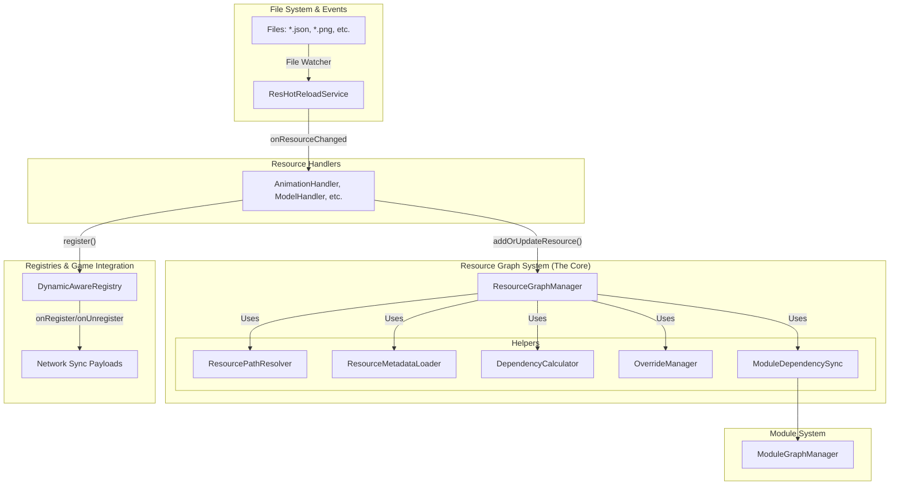

# Spark Core 动态资源系统：架构与实现指南

## 1. 架构概述

Spark Core 的动态资源系统经过全面重构，形成了一套以图为核心、模块化且可扩展的现代化架构。该系统不仅支持动态加载、更新和移除资源（如动画、模型、JS脚本、贴图、IK约束），还引入了多命名空间支持、依赖管理、模块系统等企业级特性。

### 1.1 核心设计理念

- **模块化与单一职责**: 系统被拆分为多个职责明确的组件，如路径解析、元数据加载、依赖计算等，提高了可维护性和扩展性。
- **依赖驱动架构**: 所有资源及其关系被构建成一个依赖图（Graph），实现了精确的依赖验证、循环检测和级联操作。
- **四层目录结构**: 系统采用四层目录结构`run/sparkcore/{modId}/{moduleName}/{resourceType}/`，支持多mod多模块的资源组织，实现了模块级别的资源隔离和管理。
- **统一资源发现**: `ResourceDiscoveryService`自动扫描并管理所有可用的资源来源，包括松散文件、`.spark`包和模组`assets`。
- **智能热重载**: 基于文件监控的实时资源更新，由`ResHotReloadService`驱动，变更会通过图系统精确地应用。
- **事件驱动同步**: 统一的网络同步机制，确保服务端和客户端资源状态的一致性。

### 1.2 系统架构图



---

## 2. 核心组件详解

### 2.1 `ResourceGraphManager` - 资源图的中央协调器
- **职责**: 维护全局资源依赖图，协调所有与图相关的操作。它本身不执行具体逻辑，而是委托给专门的辅助组件。
- **核心方法**: `addOrUpdateResource`, `removeResource`。

### 2.2 `ResourceDiscoveryService` - 资源发现服务
- **职责**: 在游戏启动时扫描四层目录结构（`run/sparkcore/{modId}/{moduleName}/`），发现所有可用的模块和资源类型。支持松散文件、`.spark`包和模组`assets`等多种资源来源。
- **来源类型**: 支持`LOOSE_FILES`, `SPARK_PACKAGE`, `MOD_ASSETS`。

### 2.3 `IResourceHandler` - 资源处理器接口
- **职责**: 定义了所有动态资源处理器的标准行为，如`onResourceAdded`, `onResourceModified`, `onResourceRemoved`。
- **实现类**: `AnimationHandler`, `ModelHandler`, `JavaScriptHandler`等。每个处理器负责一种资源类型。

### 2.4 `ModuleGraphManager` - 模块图管理器
- **职责**: 独立于资源图，负责管理**模块**级别的依赖。它根据模块描述文件（`spark_module.json`）构建模块依赖图，并进行拓扑排序，以确保模块按正确的顺序加载。

### 2.5 `DynamicAwareRegistry<T>` - 动态注册表
- **职责**: 动态资源管理的核心，包装了原版注册表，提供在运行时动态添加、移除和同步资源的能力。
- **网络同步**: 内置`onDynamicRegister`和`onDynamicUnregister`回调，自动触发网络同步。

---

## 3. 四层目录结构详解

### 3.1 目录结构概述

SparkCore采用四层目录结构来组织资源，格式为：`run/sparkcore/{modId}/{moduleName}/{resourceType}/`

**目录结构示例**：
```
run/sparkcore/
├── spark_core/                    # modId: spark_core
│   ├── sparkcore/                 # moduleName: sparkcore (核心模块)
│   │   ├── animations/            # 动画资源
│   │   ├── models/                # 模型资源
│   │   ├── textures/              # 纹理资源
│   │   ├── scripts/               # JavaScript脚本
│   │   └── ik_constraints/        # IK约束
│   └── combat/                    # moduleName: combat (战斗模块)
│       ├── animations/
│       └── scripts/
├── awesome_mod/                   # modId: awesome_mod
│   ├── awesome_mod/               # moduleName: awesome_mod (主模块)
│   │   ├── animations/
│   │   └── models/
│   └── magic_system/              # moduleName: magic_system (魔法系统模块)
│       └── scripts/
└── another_mod/                   # modId: another_mod
    └── another_mod/               # moduleName: another_mod
        └── animations/
```

### 3.2 ResourceLocation格式

资源的唯一标识符遵循以下格式：
```
{modId}:{moduleName}/{resourceType}/{path}
```

**示例**：
| 文件物理路径 | ResourceLocation |
|---|---|
| `run/sparkcore/spark_core/sparkcore/animations/player/idle.json` | `spark_core:sparkcore/animations/player/idle` |
| `run/sparkcore/awesome_mod/magic_system/scripts/fireball.js` | `awesome_mod:magic_system/scripts/fireball` |
| `run/sparkcore/spark_core/combat/animations/sword/attack.json` | `spark_core:combat/animations/sword/attack` |

### 3.3 模块标识格式

模块使用以下格式进行标识：
```
{modId}:{moduleName}
```

**示例**：
- `spark_core:sparkcore` - SparkCore的核心模块
- `spark_core:combat` - SparkCore的战斗模块
- `awesome_mod:magic_system` - AwesomeMod的魔法系统模块

### 3.4 向后兼容性

系统保持对旧格式的兼容性支持：
- 旧的两层格式：`run/{namespace}/{resourceType}/`
- 旧的ResourceLocation格式：`{namespace}:{path}`

迁移建议：
1. 将现有资源从`run/{namespace}/`移动到`run/sparkcore/{modId}/{moduleName}/`
2. 更新资源引用以使用新的ResourceLocation格式
3. 利用`SparkResourcePathBuilder`工具类生成标准路径

---

## 4. 【指南】添加新的动态资源类型

本节将以添加一个新的动态资源类型——`Shader`——为例，详细说明所需步骤。

### 假设:
- 新资源的数据类为 `OShader`。
- `OShader` 有一个 `StreamCodec` 用于网络序列化。
- 资源文件存放在 `run/sparkcore/{modId}/{moduleName}/shaders/` 目录下，以 `.glsl` 结尾。

### 第1步：创建资源数据类 (`OShader.kt`)

这是你资源的内存表示，必须包含序列化逻辑以便网络同步。

```kotlin
// src/main/kotlin/cn/solarmoon/spark_core/shader/OShader.kt
package cn.solarmoon.spark_core.shader

import net.minecraft.network.FriendlyByteBuf
import net.minecraft.network.codec.StreamCodec
import net.minecraft.resources.ResourceLocation

data class OShader(
    val location: ResourceLocation,
    val vertexShader: String,
    val fragmentShader: String
) {
    companion object {
        // 用于网络同步的编解码器
        @JvmField
        val STREAM_CODEC: StreamCodec<FriendlyByteBuf, OShader> = StreamCodec.of(
            { buf, shader ->
                buf.writeResourceLocation(shader.location)
                buf.writeUtf(shader.vertexShader)
                buf.writeUtf(shader.fragmentShader)
            },
            { buf ->
                OShader(
                    buf.readResourceLocation(),
                    buf.readUtf(),
                    buf.readUtf()
                )
            }
        )
        
        // 遵循ORIGINS模式，用于在游戏中存储和访问已加载的资源
        @JvmStatic
        val ORIGINS = linkedMapOf<ResourceLocation, OShader>()
    }
}
```

### 第2步：创建并注册动态注册表

在 `SparkRegistries.kt` 中，为新资源类型添加一个新的 `DynamicAwareRegistry`。

```kotlin
// src/main/kotlin/cn/solarmoon/spark_core/registry/common/SparkRegistries.kt
object SparkRegistries {
    // ... 其他注册表 ...

    @JvmStatic
    val DYNAMIC_SHADERS =
        (SparkCore.REGISTER.registry<OShader>()
            .id("dynamic_shaders") // 注册表ID
            .valueType(OShader::class)
            .build { it.sync(true).create() } as? DynamicAwareRegistry<OShader>)
            ?.apply {
                // 绑定增量同步回调
                // 注意: DynamicRegistrySyncS2CPacket需要相应扩展
                this.onDynamicRegister = { key, value ->
                    // PacketDistributor.sendToAllPlayers(DynamicRegistrySyncS2CPacket.createForShaderAdd(key.location(), value))
                }
                this.onDynamicUnregister = { key, value ->
                    // DynamicRegistrySyncS2CPacket.syncShaderRemovalToClients(key.location())
                }
            } ?: throw IllegalStateException("DYNAMIC_SHADERS registry failed to cast")
}
```

### 第3步：创建资源处理器 (`ShaderHandler.kt`)

这是新资源类型逻辑的核心，负责处理文件系统事件并与`ResourceGraphManager`交互。

```kotlin
// src/main/kotlin/cn/solarmoon/spark_core/resource/handler/ShaderHandler.kt
package cn.solarmoon.spark_core.resource.handler

import cn.solarmoon.spark_core.resource.autoregistry.AutoRegisterHandler
import cn.solarmoon.spark_core.resource.common.ResourceHandlerBase
import cn.solarmoon.spark_core.resource.graph.ResourceNode
import cn.solarmoon.spark_core.shader.OShader
import cn.solarmoon.spark_core.registry.dynamic.DynamicAwareRegistry
import net.minecraft.resources.ResourceLocation
import net.minecraft.core.RegistrationInfo
import net.minecraft.resources.ResourceKey
import kotlin.io.path.readText

@AutoRegisterHandler
class ShaderHandler(
    private val shaderRegistry: DynamicAwareRegistry<OShader>
) : ResourceHandlerBase() {

    companion object {
        init {
            cn.solarmoon.spark_core.resource.autoregistry.HandlerDiscoveryService.registerHandler {
                ShaderHandler(cn.solarmoon.spark_core.registry.common.SparkRegistries.DYNAMIC_SHADERS)
            }
        }
    }

    override fun getResourceType(): String = "shaders"
    override fun getSupportedExtensions(): Set<String> = setOf("glsl")
    override fun getRegistryIdentifier(): ResourceLocation? = shaderRegistry.key().location()

    // 资源被添加或修改时的处理逻辑
    override fun processResourceAdded(node: ResourceNode) {
        val content = node.basePath.resolve(node.relativePath).readText()
        // (你需要实现一个逻辑来分割顶点和片段着色器)
        val (vertex, fragment) = parseShaderContent(content) 
        val shader = OShader(node.id, vertex, fragment)

        // 存入静态存储
        OShader.ORIGINS[node.id] = shader
        
        // 注册到动态注册表（这将自动触发网络同步）
        val resourceKey = ResourceKey.create(shaderRegistry.key(), node.id)
        shaderRegistry.register(resourceKey, shader, RegistrationInfo.BUILT_IN)
        
        addResourceToModule(node.getFullModuleId(), node.id)
    }

    // 资源被移除时的处理逻辑
    override fun processResourceRemoved(node: ResourceNode) {
        OShader.ORIGINS.remove(node.id)
        shaderRegistry.unregisterDynamic(node.id)
        removeResourceFromModule(node.getFullModuleId(), node.id)
    }
    
    // 修改可以简化为重新添加
    override fun processResourceModified(node: ResourceNode) {
        processResourceAdded(node)
    }
    
    // 初始化逻辑（提取默认资源和扫描现有资源）
    override fun initialize(modMainClass: Class<*>): Boolean {
        // ... 实现与AnimationHandler类似的逻辑 ...
        // 1. 调用 ResourceDiscoveryService.discoverResourcePaths(getResourceType())
        // 2. 调用 MultiModuleResourceExtractionUtil.extractAllModuleResources(...)
        // 3. 遍历发现的路径，使用 ResourceDiscoveryService.scanResourceFiles(...)
        // 4. 对每个文件调用 onResourceAdded()
        return true
    }

    private fun parseShaderContent(content: String): Pair<String, String> {
        // 示例解析逻辑
        val vert = content.substringBefore("#shader fragment")
        val frag = content.substringAfter("#shader fragment")
        return Pair(vert, frag)
    }
}
```

### 第4步：Handler自动注册机制 

**自动注册原理**：
从上面的示例可以看到，每个Handler类都包含一个`companion object`的`init`块，这是SparkCore的自动注册机制的核心。

**工作流程**：
1. **类加载时注册**：当Handler类被JVM加载时，companion object的init块自动执行
2. **工厂方法存储**：`HandlerDiscoveryService.registerHandler`将Handler的工厂方法存储起来
3. **延迟实例化**：使用lambda表达式避免循环依赖，在需要时才创建Handler实例
4. **自动发现**：`HandlerDiscoveryService`优先使用自动注册的handlers，fallback到硬编码方式

**关键优势**：
- ✅ **无需硬编码**：新Handler无需在`HandlerDiscoveryService`中手动添加
- ✅ **自动发现**：系统自动发现所有标注了`@AutoRegisterHandler`的Handler类
- ✅ **向后兼容**：保留fallback机制确保系统稳定性
- ✅ **易于扩展**：添加新Handler只需实现类和companion object即可

**注意事项**：
- 必须使用完整包名避免循环导入
- 确保注册表参数正确匹配Handler的构造函数
- `@AutoRegisterHandler`注解是必需的，用于标识自动注册的Handler

### 第5步：扩展网络同步逻辑

需要扩展`DynamicRegistrySyncS2CPacket.kt`以支持`OShader`的增量同步。

1.  **添加`createForShaderAdd`方法**: 用于创建添加操作的数据包。
2.  **添加`syncShaderRemovalToClients`方法**: 用于发送移除操作的数据包。
3.  **在`handleInClient`中添加`handleShaderSync`分支**:
    ```kotlin
    when (packet.registryKey) {
        // ...
        SparkRegistries.DYNAMIC_SHADERS.key() -> handleShaderSync(packet)
    }
    ```
4.  **实现`handleShaderSync`**: 在客户端接收数据包后，反序列化`OShader`并更新本地的`DynamicAwareRegistry`。

### 第5步：完成！

完成以上步骤后，你就为 `Shader` 资源实现了一套完整的动态管理系统。它将无缝地集成到现有架构中，并自动获得热重载、四层目录结构支持、依赖管理和网络同步功能。这个模式可以被复制用于任何新的资源类型。