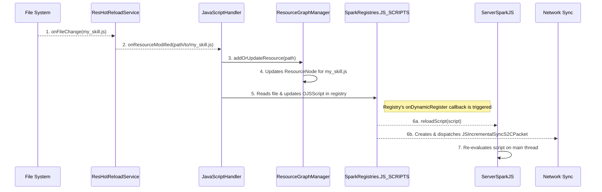

# SparkCore JavaScript 系统完整指南

## 目录
1. [系统架构概览](#1-系统架构概览)
2. [运行时执行流程](#2-运行时执行流程)
3. [热重载机制](#3-热重载机制)
4. [网络同步详解](#4-网络同步详解)
5. [系统重构详解](#5-系统重构详解)
6. [开发指南](#6-开发指南)
7. [技术细节](#7-技术细节)
8. [故障排除](#8-故障排除)

## 1. 系统架构概览

SparkCore 的 JavaScript 系统基于 Mozilla Rhino 引擎构建，提供了一个强大的脚本执行环境。在新架构下，它与核心资源系统紧密集成，支持动态脚本加载、热重载和网络同步。

### 1.1 核心组件

#### SparkJS 基类系统
```kotlin
abstract class SparkJS {
    val context = Context.enter()      // Rhino JavaScript 上下文
    val scope = context.initStandardObjects()  // 标准对象作用域

    // 核心方法
    open fun loadAllFromRegistry()
    open fun reloadScript(script: OJSScript)
    open fun unloadScript(apiId: String, fileName: String)
    protected open fun executeScript(script: OJSScript)
}
```

#### 服务端与客户端实现
- **ServerSparkJS**: 服务端脚本执行，支持线程安全和网络同步。
- **ClientSparkJS**: 客户端脚本执行，在渲染线程执行。

#### JSApi 接口系统
```kotlin
interface JSApi {
    val id: String // API 模块唯一标识 (如 'skill', 'animation')

    fun onLoad()    // 脚本加载完成后调用
    fun onReload()  // 脚本重载时调用
}
```

#### 脚本数据模型
```kotlin
data class OJSScript(
    val apiId: String,              // API模块ID
    val fileName: String,           // 脚本文件名
    val content: String,            // 脚本内容
    val location: ResourceLocation  // 资源位置标识
)
```

#### 热重载核心组件
- **`ResHotReloadService`**: 底层的文件监控服务，使用 `commons-io.monitor` 库监听文件系统的变化（创建、修改、删除）。
- **`JavaScriptHandler`**: 实现了 `IResourceHandler` 接口，是JS资源的专属处理器。它负责响应 `ResHotReloadService` 的事件，并与资源图系统交互。
- **`ResourceGraphManager`**: 资源图的核心，负责管理JS脚本作为图中的一个节点，包括其路径、元数据和依赖关系。
- **`DynamicAwareRegistry` (`SparkRegistries.JS_SCRIPTS`)**: 动态注册表，存储 `OJSScript` 对象。它的变更会自动触发网络同步和脚本重载回调。

### 1.2 数据流架构

JS脚本现在是资源图的一部分，其加载和管理完全融入了新的资源系统。

```mermaid
graph TD
    subgraph "File System & Hot Reload"
        A["run/sparkcore/my_mod/my_mod/scripts/skill/my_skill.js"] -- File Event --> B[ResHotReloadService]
    end

    subgraph "Resource System"
        C[JavaScriptHandler] -- addOrUpdateResource() --> D[ResourceGraphManager]
        D -- "Calculates dependencies, etc." --> E[ResourceNode for my_skill.js]
    end
    
    subgraph "JS Engine & Registries"
        F[SparkRegistries.JS_SCRIPTS] -- Notifies --> G[ServerSparkJS]
        G -- Executes Script --> H[Rhino Context]
        H -- Calls --> I[JSApi (e.g., JSSkillApi)]
    end
    
    subgraph "Network Sync"
        J[JSIncrementalSyncS2CPacket]
    end

    B --> C
    C -- "Registers OJSscript" --> F
    F -- "onDynamicRegister callback" --> J
    G -- "reloadScript()" --> H
    J -- "Sends to client" --> K[Client]

```

## 2. 运行时执行流程

### 2.1 核心架构交互图

```mermaid
sequenceDiagram
    participant FS as File System
    participant HRS as ResHotReloadService
    participant JSH as JavaScriptHandler
    participant RGM as ResourceGraphManager
    participant REG as SparkRegistries.JS_SCRIPTS
    participant SJS as ServerSparkJS
    participant NET as Network Sync
    participant CJS as ClientSparkJS

    Note over FS, CJS: Initial Load / Player Join
    HRS ->> JSH: initialize()
    JSH ->> FS: Scans for all .js files
    JSH ->> RGM: addOrUpdateResource(file) for each script
    RGM ->> REG: Registers all OJSScript
    REG ->> SJS: Server executes all scripts via loadAllFromRegistry()

    SJS ->> NET: Sends JSScriptDataSyncPayload (Full Sync) to new Client
    NET ->> CJS: Receives Full Sync
    CJS ->> REG: Clears and re-registers all scripts
    CJS ->> CJS: Executes all scripts via loadAllFromRegistry()

    Note over FS, CJS: Hot Reload (File Change)
    FS ->> HRS: Detects file change (e.g., my_skill.js modified)
    HRS ->> JSH: onResourceModified(file)
    JSH ->> RGM: addOrUpdateResource(file)
    RGM ->> REG: Updates OJSScript in registry

    REG -- onDynamicRegister callback --> NET: Creates JSIncrementalSyncS2CPacket
    REG -- onDynamicRegister callback --> SJS: reloadScript(script)
    SJS ->> SJS: Re-evaluates the modified script

    NET ->> CJS: Receives Incremental Sync Packet
    CJS ->> REG: Updates single OJSScript in registry
    CJS ->> CJS: reloadScript(script)
    CJS ->> CJS: Re-evaluates the script on render thread
```

### 2.2 系统初始化序列

#### 阶段一：服务器启动与初始加载

1.  **资源发现**: `ResourceDiscoveryService` 扫描四层目录结构 `run/sparkcore/{modId}/{moduleName}/`，发现 `scripts` 资源类型。
2.  **处理器初始化**: `HandlerDiscoveryService` 实例化 `JavaScriptHandler`。
3.  **初始扫描**: `JavaScriptHandler.initialize()` 被调用，它会：
    -   扫描所有已发现的 `scripts` 目录下的 `.js` 文件。
    -   对每个文件调用 `onResourceAdded()`。
4.  **图节点创建**: 在 `onResourceAdded()` 内部，`ResourceGraphManager.addOrUpdateResource()` 被调用。
    -   `ResourcePathResolver` 将文件路径转换为 `ResourceLocation` (如 `my_mod:my_mod/scripts/skill/my_skill`)。
    -   `ResourceNode` 在资源图中被创建。
    -   `DependencyCalculator` 根据 `.meta.json` 文件或默认规则计算脚本的依赖。
5.  **脚本注册**: `JavaScriptHandler` 读取脚本内容，创建一个 `OJSScript` 对象，并将其注册到 `SparkRegistries.JS_SCRIPTS` 动态注册表中。
6.  **服务端执行**: `SparkJsApplier.onLevelLoad` 触发 `ServerSparkJS.loadAllFromRegistry()`，从注册表中获取所有脚本并首次执行它们。

#### 阶段二：客户端连接与全量同步

1.  **玩家登录**: 新玩家连接到服务器。
2.  **全量同步任务**:
    -   `JSScriptDataSendingTask` 被创建。
    -   它从 `SparkRegistries.JS_SCRIPTS` 收集所有 `OJSScript` 实例。
    -   所有脚本数据被打包成一个 `JSScriptDataSyncPayload`。
3.  **数据包发送**: 该数据包被发送到新连接的客户端。
4.  **客户端处理**:
    -   `JSScriptDataSyncPayload.handleInClient` 方法被调用。
    -   客户端首先清空本地的 `SparkRegistries.JS_SCRIPTS`。
    -   然后，将数据包中的所有脚本注册到本地注册表。
    -   最后，调用 `ClientSparkJS.instance.loadAllFromRegistry()`，在渲染线程上执行所有脚本，并调用 `JSApi.onLoad()`。

### 2.3 服务端执行策略

**线程安全执行机制**:
```kotlin
override fun executeScript(script: OJSScript) {
    val server = ServerLifecycleHooks.getCurrentServer()
    if (server != null) {
        // 确保在服务器主线程执行
        server.execute {
            super.executeScript(script)
        }
    } else {
        // 如果服务器未启动，直接执行（启动阶段）
        super.executeScript(script)
    }
}
```

### 2.4 客户端执行策略

**渲染线程执行**:
```kotlin
override fun executeScript(script: OJSScript) {
    val minecraft = Minecraft.getInstance()
    if (minecraft.isSameThread) {
        // 已在渲染线程，直接执行
        super.executeScript(script)
    } else {
        // 切换到渲染线程执行
        minecraft.execute {
            super.executeScript(script)
        }
    }
}
```

### 2.5 关键问题与解决方案

#### 线程安全
- **问题**: 文件系统事件在I/O线程触发，而Rhino JS引擎不是线程安全的。
- **解决方案**: `ServerSparkJS` 和 `ClientSparkJS` 的 `executeScript` 方法内部会使用 `server.execute` 和 `minecraft.execute` 将脚本的执行切换到相应的游戏主线程或渲染线程，确保线程安全。

#### 数据一致性
- **问题**: 如何保证服务端和客户端的脚本及其状态一致？
- **解决方案**:
    - **单一数据源**: 服务端 `SparkRegistries.JS_SCRIPTS` 是所有脚本的权威来源。
    - **双重同步**: 玩家登录时的全量同步确保了初始状态一致，运行时的增量同步保证了后续变更的实时一致。

#### 脚本执行时机
- **问题**: 脚本需要在其依赖的API（如`SkillManager`）准备好之后执行。
- **解决方案**:
    - `JSApi` 模块的 `onLoad()` 方法提供了一个明确的回调时机。脚本在 `eval` 阶段通常只做声明（如 `Skill.create`），实际的注册和初始化逻辑则在 `onLoad` 中执行，此时所有脚本都已加载，核心API也已可用。

## 3. 热重载机制

### 3.1 热重载工作流程

当一个JS文件被修改时，会触发以下完整的事件链：



#### 详细流程步骤

1.  **文件监控**: `ResHotReloadService` 检测到 `my_skill.js` 文件被修改。
2.  **处理器响应**: 它调用已注册的 `JavaScriptHandler` 的 `onResourceModified` 方法，并传入文件路径。
3.  **资源图更新**: `JavaScriptHandler` 调用 `ResourceGraphManager.addOrUpdateResource()`。`ResourceGraphManager` 负责更新图中代表该脚本的 `ResourceNode` 的元数据和属性，但它不关心脚本的具体内容。
4.  **注册表更新**: `JavaScriptHandler` 读取更新后的脚本文件内容，创建一个新的 `OJSScript` 对象，并用它更新 `SparkRegistries.JS_SCRIPTS` 中对应的条目。
5.  **触发回调**: `DynamicAwareRegistry` 的 `onDynamicRegister` 回调被触发。这个回调是实现热重载的关键，它会并行执行两个操作：
    a.  **服务端执行**: 调用 `ServerSparkJS.instance.reloadScript()`。
    b.  **网络同步**: 创建一个 `JSIncrementalSyncS2CPacket` 并将其广播给所有客户端。
6.  **脚本重载**: `ServerSparkJS` 在服务器主线程上安全地重新执行该脚本，应用新的逻辑。
7.  **客户端同步**: 客户端接收到增量同步包，更新自己的注册表，并同样调用 `ClientSparkJS` 来重载脚本。

### 3.2 文件监控实现

`ResHotReloadService` 监控脚本文件目录的变更。当文件被修改、创建或删除时，会通知 `JavaScriptHandler`。

**监控目录结构** (四层结构):
```
run/sparkcore/
├── {modId}/
│   ├── {moduleName}/
│   │   ├── scripts/
│   │   │   ├── {api_id}/
│   │   │   │   ├── script1.js
│   │   │   │   ├── script2.js
│   │   │   │   └── ...
│   │   │   └── ...
│   │   └── ...
│   └── ...
└── ...
```

**示例**:
```
run/sparkcore/
├── my_mod/
│   ├── my_mod/
│   │   └── scripts/
│   │       ├── skill/
│   │       │   ├── fireball.js
│   │       │   └── heal.js
│   │       └── ik/
│   │           └── player_ik.js
│   └── combat_system/
│       └── scripts/
│           └── skill/
│               └── combo_attack.js
└── spark_core/
    └── sparkcore/
        └── scripts/
            ├── skill/
            │   └── test.js
            └── resource_path/
                └── path_helper.js
```

### 3.3 API ID提取逻辑

`JavaScriptHandler` 使用 `extractApiIdFromPath()` 方法从脚本的 ResourceLocation 中提取 API ID，支持四层目录结构：

**提取规则**：
1. **四层结构优先**: 从路径中查找 `/scripts/` 或 `/script/`，提取其后的第一个目录名作为 API ID
2. **传统格式兼容**: 支持以 `scripts/` 或 `script/` 开头的传统路径格式
3. **默认回退**: 如果无法提取，默认使用 `skill` API

**示例**：
| ResourceLocation | 提取的API ID | 说明 |
|---|---|---|
| `my_mod:my_mod/scripts/skill/fireball` | `skill` | 四层结构，从 `/scripts/` 后提取 |
| `spark_core:sparkcore/scripts/ik/player_ik` | `ik` | 四层结构，从 `/scripts/` 后提取 |
| `my_mod:my_mod/scripts/resource_path/helper` | `resource_path` | 四层结构，从 `/scripts/` 后提取 |
| `old_mod:scripts/skill/legacy` | `skill` | 传统格式兼容 |

**代码实现**：
```kotlin
private fun extractApiIdFromPath(location: ResourceLocation): String {
    val path = location.path

    // 处理四层目录结构: {moduleName}/scripts/{api_id}/{fileName}
    if (path.contains("/scripts/")) {
        val pathParts = path.split("/")
        val scriptsIndex = pathParts.indexOf("scripts")
        if (scriptsIndex >= 0 && scriptsIndex + 1 < pathParts.size) {
            return pathParts[scriptsIndex + 1]
        }
    }

    // 其他格式处理...
    return "skill" // 默认值
}
```

### 3.4 关键实现细节

#### 线程安全
- **问题**: 文件监控事件在独立的I/O线程中发生，而JS引擎（Rhino）和游戏逻辑（Minecraft）都不是线程安全的。
- **解决**: `JavaScriptHandler` 的工作是轻量级的（调用`RGM`和更新注册表），这些操作本身是线程安全的。真正的脚本执行逻辑被委托给了 `ServerSparkJS` 和 `ClientSparkJS`，它们内部使用 `server.execute()` 和 `minecraft.execute()` 将 `eval` 操作切换到游戏主线程或渲染线程，从而保证了线程安全。

#### 状态管理与清理
- **问题**: 重载脚本时，如何清理旧脚本定义的对象或监听器，以避免内存泄漏或逻辑冲突？
- **解决**: `JSApi` 接口提供了 `onReload()` 方法。在 `reloadScript` 期间，会先调用对应API模块的 `onReload()`，开发者应在此方法中实现清理逻辑（如清除旧的技能定义、移除事件监听器等），然后再执行新的脚本。

```kotlin
// 在 ServerSparkJS.reloadScript 中
val api = JSApi.ALL[script.apiId]
api?.onReload() // 先调用清理钩子
executeScript(script) // 再执行新脚本
api?.onLoad()
```

#### 数据一致性
- **问题**: 如何确保所有客户端和服务端的脚本版本始终一致？
- **解决**: 服务端的 `DynamicAwareRegistry` 是唯一的数据权威来源。任何对注册表的修改都会自动触发网络同步事件，确保变更被可靠地分发到所有客户端，从而维护了整个系统的数据一致性。

### 3.5 增量同步协议

#### 增量同步数据包
```kotlin
data class JSIncrementalSyncS2CPacket(
    val apiId: String,
    val fileName: String,
    val operationType: ChangeType,  // ADDED, MODIFIED, REMOVED
    val scriptContent: String
)
```

#### 阶段三：热重载与增量同步

1.  **文件变更**: 开发者在文件系统中修改、创建或删除了一个 `.js` 文件。
2.  **事件捕获**: `ResHotReloadService` 捕获到文件变更事件。
3.  **处理器响应**:
    -   根据文件路径，确定应由 `JavaScriptHandler` 处理。
    -   调用 `onResourceAdded`, `onResourceModified`, 或 `onResourceRemoved`。
4.  **资源图与注册表更新**:
    -   流程与初始化阶段类似，`ResourceGraphManager` 更新图节点，`JavaScriptHandler` 更新 `SparkRegistries.JS_SCRIPTS` 中的 `OJSScript` 实例。
5.  **服务端重新加载**:
    -   `DynamicAwareRegistry` 的 `onDynamicRegister` (或 `onDynamicUnregister`) 回调被触发。
    -   该回调调用 `ServerSparkJS.instance.reloadScript()` 或 `unloadScript()`。
    -   `ServerSparkJS` 会调用相应 `JSApi` 的 `onReload()` 方法清理旧状态，然后在服务器主线程重新执行脚本。
6.  **增量同步**:
    -   `onDynamicRegister` 回调同时会创建一个 `JSIncrementalSyncS2CPacket`。
    -   该包包含变更的脚本内容和操作类型 (`ADDED`, `MODIFIED`, `REMOVED`)。
    -   数据包被广播给所有在线客户端。
7.  **客户端应用变更**:
    -   客户端接收到增量同步包。
    -   根据操作类型，更新本地注册表中的单个 `OJSScript`。
    -   调用 `ClientSparkJS.instance.reloadScript()` 或 `unloadScript()`，在渲染线程上应用脚本变更。

## 4. 网络同步详解

### 4.1 全量同步机制（玩家登录）

**配置阶段同步**:
`JSScriptDataSendingTask` 在玩家登录时，会从`SparkRegistries.JS_SCRIPTS`获取所有脚本，打包成`JSScriptDataSyncPayload`，一次性发送给客户端。

**客户端处理**:
客户端收到全量包后，会清空本地的动态脚本注册表，然后注册所有接收到的脚本，最后调用 `ClientSparkJS.instance.loadAllFromRegistry()` 来执行它们。

### 4.2 增量同步机制（运行时更新）

**服务端触发**:
`DynamicAwareRegistry` 在其条目被更新时，会触发 `onDynamicRegister` 回调，该回调负责创建并发送 `JSIncrementalSyncS2CPacket`。

**客户端接收**:
客户端的 `JSIncrementalSyncS2CPacket` 处理器会根据包中的操作类型（`ADDED`, `MODIFIED`, `REMOVED`）来更新本地的注册表，并调用 `ClientSparkJS` 中相应的方法（`reloadScript` 或 `unloadScript`）来应用变更。

### 4.3 优化的同步数据结构

**核心组件：**
- `JSScriptDataSyncPayload` - 全量同步数据包
- `JSIncrementalSyncS2CPacket` - 增量同步数据包
- `JSScriptDataSendingTask` - 配置阶段任务

**数据结构优化：**
```kotlin
data class JSScriptDataSyncPayload(
    val scripts: LinkedHashMap<ResourceLocation, OJSScript>
) : CustomPacketPayload

data class JSIncrementalSyncS2CPacket(
    val apiId: String,
    val fileName: String,
    val operationType: ChangeType,
    val scriptContent: String
) : CustomPacketPayload
```

**同步策略改进**：
- **全量同步**：新玩家加入时发送完整脚本数据
- **增量同步**：运行时脚本变更的实时同步
- **容错机制**：客户端确认机制确保同步完整性
- **性能优化**：减少不必要的数据传输

## 5. 系统重构详解

### 5.1 重构概述

本次重构针对 SparkCore 的 JavaScript 脚本系统进行了全面的架构优化，主要目标是提升系统的稳定性、性能和可维护性。重构涉及攻击系统增强、初始化流程优化、同步机制改进以及物理碰撞处理的完善。

### 5.2 新增 AttackSystemMixin 类实现攻击系统功能

#### 核心变更

**新增文件：**
- `src/main/java/cn/solarmoon/spark_core/mixin/js/AttackSystemMixin.java`
- `src/main/kotlin/cn/solarmoon/spark_core/js/extension/JSAttackSystem.kt`

**实现细节：**
```java
@Mixin(AttackSystem.class)
public class AttackSystemMixin implements JSAttackSystem {
    // 通过 Mixin 将 JSAttackSystem 接口混入到 AttackSystem 类中
}
```

```kotlin
interface JSAttackSystem {
    val attackSystem get() = this as AttackSystem

    // 提供 JavaScript 友好的攻击系统API
    fun reset()
    fun hasAttacked(entityId: Int): Boolean
    fun setAutoReset(enabled: Boolean, resetAfterTicks: Int = 1)
    fun getTicksSinceLastReset(): Int
    fun getAttackedEntityCount(): Int
    fun setIgnoreInvulnerableTime(ignore: Boolean)
}
```

#### 功能增强

- **攻击状态管理**：提供了更完善的攻击状态跟踪和重置机制
- **JavaScript 集成**：将攻击系统暴露给 JavaScript 脚本，支持脚本化攻击逻辑
- **网络同步**：通过 `AttackSystemSyncPayload` 实现客户端与服务端的状态同步

### 5.3 优化 SparkCore 初始化流程

#### 初始化顺序调整

**修改文件：** `src/main/java/cn/solarmoon/spark_core/SparkCore.java`

**关键变更：**
```java
// 显式初始化 JSApi.ALL，确保在 HandlerDiscoveryService 之前完成
JSApi.Companion.register();

HandlerDiscoveryService.INSTANCE.discoverAndInitializeHandlers(getClass());
```

#### 解决的问题

- **依赖顺序问题**：确保 JavaScript API 在资源处理器发现之前完成注册
- **初始化竞态**：避免因初始化顺序不当导致的 `UninitializedPropertyAccessException`
- **系统稳定性**：提高模组启动的可靠性

### 5.4 改进 JSEntity 接口

#### 接口增强

**修改文件：** `src/main/kotlin/cn/solarmoon/spark_core/js/extension/JSEntity.kt`

**新增功能：**
```kotlin
interface JSEntity {
    // 调试支持
    fun commonAttack(target: Entity, currentAttackPhase: Int) {
        // 增加了当前攻击阶段参数用于调试
        println("attack on currentAttackPhase $currentAttackPhase")
        // ... 攻击逻辑
    }

    // 新增日志输出方法
    fun log(message: String) {
        SparkCore.LOGGER.info("发送消息: {}", message)
    }
}
```

#### 功能价值

- **调试支持**：为 JavaScript 脚本提供直接的日志输出能力
- **攻击系统增强**：支持攻击阶段跟踪和调试
- **开发体验**：简化脚本调试流程

### 5.5 重构 JS 物理碰撞对象的攻击回调逻辑

#### 回调机制优化

**核心文件：**
- `src/main/kotlin/cn/solarmoon/spark_core/physics/presets/callback/AttackCollisionCallback.kt`
- `src/main/kotlin/cn/solarmoon/spark_core/js/extension/JSPhysicsCollisionObject.kt`

**重构要点：**
```kotlin
interface AttackCollisionCallback: CollisionCallback {
    val attackSystem: AttackSystem

    override fun onProcessed(o1: PhysicsCollisionObject, o2: PhysicsCollisionObject, manifoldId: Long) {
        val attacker = o1.owner as? Entity ?: return
        (o2.owner as? Entity)?.apply {
            attackSystem.customAttack(this) {
                // 优化后的攻击逻辑
                preAttack(attackSystem.attackedEntities.isEmpty(), attacker, this@apply, o1, o2, manifoldId)
                if (!doAttack(attacker, this@apply, o1, o2, manifoldId)) return@customAttack false
                postAttack(attacker, this@apply, o1, o2, manifoldId)
                true
            }
        }
    }
}
```

#### JavaScript 集成

```kotlin
fun onAttackCollide(id: String, consumer: Scriptable, customAttackSystem: AttackSystem? = null) {
    // 支持自定义攻击系统
    // 提供 preAttack, doAttack, postAttack 钩子
    // 线程安全的脚本执行
}
```

### 5.6 重新设计客户端和服务端 JS 引擎执行策略

#### 线程安全执行

**服务端策略** (`ServerSparkJS.kt`)：
```kotlin
override fun executeScript(script: OJSScript) {
    val server = ServerLifecycleHooks.getCurrentServer()
    if (server != null) {
        // 确保在服务器主线程执行
        server.execute {
            super.executeScript(script)
        }
    } else {
        // 启动阶段直接执行
        super.executeScript(script)
    }
}
```

**客户端策略** (`ClientSparkJS.kt`)：
```kotlin
override fun executeScript(script: OJSScript) {
    val minecraft = Minecraft.getInstance()
    if (minecraft.isSameThread) {
        super.executeScript(script)
    } else {
        // 切换到渲染线程执行
        minecraft.execute {
            super.executeScript(script)
        }
    }
}
```

#### 执行时机优化

- **服务端**：在 Level 加载时立即从注册表加载脚本
- **客户端**：延迟到玩家登录完成后加载，避免网络同步冲突
- **热重载**：支持运行时脚本重载，同时保证线程安全

### 5.7 统一 JS 脚本注册、加载和卸载接口

#### 统一接口设计

**基类方法** (`SparkJS.kt`)：
```kotlin
abstract class SparkJS {
    // 从动态注册表加载所有脚本
    open fun loadAllFromRegistry()

    // 重新加载单个脚本
    open fun reloadScript(script: OJSScript)

    // 卸载脚本
    open fun unloadScript(apiId: String, fileName: String)

    // 线程安全的脚本执行（子类重写）
    protected open fun executeScript(script: OJSScript)
}
```

#### 应用层简化

**初始化统一**：
```kotlin
// SparkJsApplier.kt
if (js is ServerSparkJS) {
    js.loadAllFromRegistry()  // 服务端立即加载
} else {
    // 客户端延迟加载
}
```

### 5.8 调整动态注册表和动画处理器的内部实现

#### 注册表优化

**核心改进：**
- **统一数据访问**：`SparkRegistries.JS_SCRIPTS.getDynamicEntries()`
- **同步机制**：自动触发网络同步的回调机制
- **容错处理**：改善错误处理和恢复机制

**关键代码：**
```kotlin
val JS_SCRIPTS = (SparkCore.REGISTER.registry<OJSScript>()
    .id("js_scripts")
    .valueType(OJSScript::class)
    .build { it.sync(true).create() } as? DynamicAwareRegistry<OJSScript>)
    ?.apply {
        this.onDynamicRegister = { key, value ->
            // 自动同步到客户端
            val packet = DynamicRegistrySyncS2CPacket.createForJSScriptAdd(key.location(), value)
            PacketDistributor.sendToAllPlayers(packet)
        }
    }
```

#### 动画处理器增强

- **TypedAnimation 注册**：改进动态动画的注册和管理
- **资源热重载**：支持动画资源的运行时更新
- **同步优化**：减少动画同步的网络开销

## 6. 开发指南

### 6.1 创建自定义 JSApi

**步骤1: 实现 JSApi 接口**
```kotlin
class CustomJSApi : JSApi {
    override val id: String = "custom"

    override fun onLoad() {
        // 处理脚本加载完成后的逻辑
    }

    override fun onReload() {
        // 处理脚本重载时的清理逻辑
    }
}
```

**步骤2: 注册 JSApi**
通过`@EventBusSubscriber`监听`SparkJSRegisterEvent`来注册你的API。

**步骤3: 创建脚本目录**
```
run/sparkcore/my_mod/my_mod/scripts/custom/
├── init.js
└── ...
```

### 6.2 脚本编写最佳实践

#### 基本脚本结构
```javascript
// ResourceID: my_mod:my_mod/scripts/custom/example

// 1. 全局函数定义
function customFunction() { /* ... */ }

// 2. 注册自定义内容
// (调用你自定义的JSApi暴露的方法)
CustomApi.register("example", { /* ... */ });
```

#### 错误处理
```javascript
try {
    riskyOperation();
} catch (e) {
    Logger.error("脚本执行出错: " + e.message);
}
```

#### 与原生 Java/Kotlin 交互
```javascript
// 访问 Java 类
var JavaClass = Java.type("java.util.ArrayList");
var list = new JavaClass();

// 调用 SparkCore API
var SparkCore = Java.type("cn.solarmoon.spark_core.SparkCore");
SparkCore.LOGGER.info("来自JavaScript的消息");
```

## 7. 技术细节

### 7.1 数据访问

`OJSScript.get(resourceLocation)` 等方法现在会优先从 `DynamicAwareRegistry` 中查找资源，如果找不到，再回退到静态的 `ORIGINS` 映射。这保证了动态加载的资源总能被正确访问。

### 7.2 线程安全设计

**服务端线程安全**: 所有脚本执行都通过 `server.execute()` 提交到服务器主线程。
**客户端线程安全**: 所有脚本执行都通过 `minecraft.execute()` 提交到渲染线程。

### 7.3 内存管理

脚本的生命周期与它在 `DynamicAwareRegistry` 中的注册状态绑定。当脚本从注册表中移除时（例如，文件被删除），`JavaScriptHandler` 会调用 `unloadScript` 来清理其在JS引擎中的状态，防止内存泄漏。

### 7.4 技术亮点

#### 线程安全设计

- **服务端**：所有脚本执行都在主线程进行
- **客户端**：确保在渲染线程执行，避免线程冲突
- **资源处理**：使用任务队列处理文件系统变更

#### 网络同步优化

- **配置阶段同步**：新玩家加入时的全量数据传输
- **增量同步**：运行时的最小化数据传输
- **确认机制**：确保数据传输的可靠性

#### 错误处理增强

- **防御性编程**：添加大量空值检查和异常处理
- **优雅降级**：当某些组件不可用时的回退机制
- **调试支持**：详细的日志输出和错误追踪

#### 性能优化

- **懒加载**：按需加载和初始化组件
- **缓存机制**：减少重复计算和网络传输
- **内存管理**：改进对象生命周期管理

### 7.5 向后兼容性

#### 保持兼容的设计

- **API 稳定性**：现有 JavaScript API 保持不变
- **配置兼容**：支持旧的配置文件格式
- **渐进迁移**：新旧机制并存，允许逐步迁移

#### 迁移指南

开发者无需修改现有的 JavaScript 脚本，新的机制在后台透明运行。但建议：

1. **日志调试**：利用新的 `entity.log()` 方法替代 `print()`
2. **攻击系统**：使用新的攻击系统 API 获得更好的性能
3. **错误处理**：添加适当的错误处理逻辑

## 8. 故障排除

### 8.1 启用调试日志
在 `sparkcore.properties` 或相关日志配置文件中启用DEBUG级别日志。

### 8.2 常见问题诊断

**1. 脚本未加载**
- 检查文件是否在正确的 `run/sparkcore/{modId}/{moduleName}/scripts/{api_id}/` 目录下。
- 确认 JSApi 已正确注册。
- 查看 `debug.log` 中 `JavaScriptHandler` 和 `ResourceGraphManager` 的日志。

**2. 网络同步失败**
- 检查服务端与客户端版本一致性。
- 确认网络连接正常。
- 查看与 `JS...Sync...Packet` 相关的日志。

**3. 线程安全问题**
新架构通过在 `ServerSparkJS` 和 `ClientSparkJS` 中切换线程，已基本解决此问题。确保你的脚本中没有长时间的阻塞操作。

**4. 热重载不工作**
- 确认 `ResHotReloadService` 正在运行
- 检查文件权限和监控目录配置
- 查看热重载相关的日志输出

**5. 攻击系统问题**
- 确认 `AttackSystemMixin` 正确加载
- 检查攻击系统的初始化状态
- 验证攻击回调的注册情况

### 8.3 测试验证

#### 验证要点

1. **脚本加载**：确认所有脚本正确加载和执行
2. **网络同步**：验证客户端与服务端的数据一致性
3. **热重载**：测试运行时脚本修改的即时生效
4. **攻击系统**：验证攻击逻辑的正确性和性能
5. **线程安全**：确认无并发问题和竞态条件

#### 性能指标

- **启动时间**：模组初始化时间优化
- **内存使用**：降低运行时内存占用
- **网络带宽**：减少同步数据传输量
- **脚本执行**：提升 JavaScript 脚本执行效率

## 9. 结论

SparkCore 的 JavaScript 系统通过与新资源系统深度集成，提供了一个强大、稳定且可扩展的脚本执行环境。通过统一的架构设计、线程安全的执行机制和智能的网络同步，为开发者提供了高效的脚本开发和部署体验。

本次重构显著提升了系统的稳定性、性能和可维护性。通过统一的接口设计、优化的同步机制和增强的错误处理，为开发者提供了更加可靠和高效的脚本开发环境。同时，新的攻击系统和物理碰撞处理为游戏机制的实现提供了更强大的支持。

新的动态注册表系统确保了数据一致性和系统可靠性，同时保持了良好的向后兼容性。SparkCore的JavaScript运行时流程是一个健壮、事件驱动的系统，它利用了新的资源图架构进行资源管理和依赖追踪，通过双重同步机制保证了数据一致性，并解决了线程安全问题，为开发者提供了一个可靠且高效的脚本热重载开发体验。