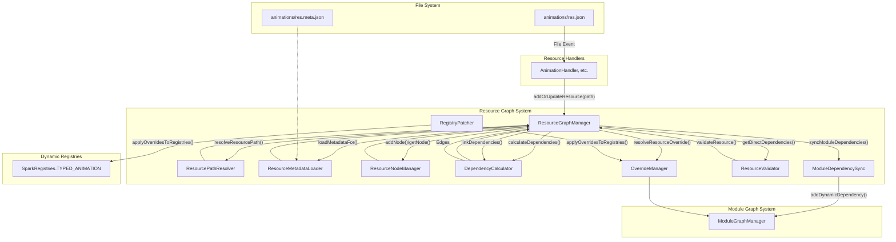

# SparkCore 资源系统架构概览

## 1. 系统概述

SparkCore 资源系统经过全面重构，形成了一套现代化、模块化且可扩展的架构。该系统不仅支持动态加载、更新和移除资源（如动画、模型、JS脚本、贴图、IK约束），还引入了多命名空间支持、基于图的依赖管理、模块系统等企业级特性。

### 1.1 核心设计理念

- **模块化与单一职责**: 系统被拆分为多个职责明确的组件，如路径解析、元数据加载、依赖计算等，提高了可维护性和扩展性。
- **依赖驱动架构**: 所有资源及其关系被构建成一个依赖图（Graph），实现了精确的依赖验证、循环检测和级联操作。
- **多命名空间支持**: 系统现在支持从任意命名空间发现和管理资源，不再局限于单一的`sparkcore`目录。
- **统一资源发现**: `ResourceDiscoveryService`自动扫描并管理所有可用的资源来源，包括松散文件、`.spark`包和模组`assets`。
- **智能热重载**: 基于文件监控的实时资源更新，由`ResHotReloadService`驱动，变更会通过图系统精确地应用。
- **事件驱动同步**: 统一的网络同步机制，确保服务端和客户端资源状态的一致性。

### 1.2 系统架构图

新的架构以`ResourceGraphManager`为核心，协调各个子系统共同完成资源管理。



## 2. 核心组件详解

### 2.1 资源图系统 (Resource Graph System)

这是新架构的核心，负责管理所有资源及其关系。

- **`ResourceGraphManager`**: 中央协调器。它接收来自资源处理器的请求，并委托给其他组件来构建和维护资源图。
- **`ResourceNodeManager`**: 负责`ResourceNode`（代表单个资源）的创建、存储和检索。
- **`ResourcePathResolver`**: 将物理文件路径解析为标准的`ResourceLocation`和相关路径信息。
- **`ResourceMetadataLoader`**: 加载和解析`.meta.json`文件，如果文件不存在则生成默认元数据。
- **`DependencyCalculator`**: 根据预设规则（例如，动画依赖于同名模型）自动计算资源间的依赖关系。
- **`OverrideManager`**: 管理资源间的覆盖关系，并根据模块优先级解决覆盖冲突。
- **`RegistryPatcher`**: 将解析出的覆盖规则应用到动态注册表中，实现真正的资源替换。
- **`ResourceValidator`**: 提供接口用于验证资源的依赖是否完整和有效。
- **`ModuleDependencySync`**: 当资源依赖跨越不同模块时，自动在模块级别创建依赖关系。

### 2.2 资源发现与处理

- **`ResourceDiscoveryService`**: 在游戏启动时扫描所有已知位置（`sparkcore/`, `mods/`, `.spark`包），发现所有可用的资源命名空间和类型。

- **`HandlerDiscoveryService`**: 负责发现和注册所有资源处理器。现在支持自动注册机制：
  - **自动注册**: Handler类通过`@AutoRegisterHandler`注解和companion object的init块自动注册
  - **向后兼容**: 保留硬编码fallback机制确保系统稳定性
  - **职责专一**: 专注于handler发现、注册和生命周期管理

- **`ResourceHandler` (如 `AnimationHandler`)**: 每种资源类型都有一个对应的处理器。它们负责：
  1. 监视文件系统变更。
  2. 在文件变更时调用`ResourceGraphManager.addOrUpdateResource()`。
  3. 将解析后的资源注册到对应的`DynamicAwareRegistry`中。

  **Handler自动注册示例**：
  ```kotlin
  @AutoRegisterHandler
  class AnimationHandler(...) : ResourceHandlerBase() {
      companion object {
          init {
              HandlerDiscoveryService.registerHandler {
                  AnimationHandler(SparkRegistries.TYPED_ANIMATION)
              }
          }
      }
  }
  ```

- **`DynamicResourceApplier`**: 专注于热重载服务的启动和配置，移除了重复的handler生命周期管理代码。

### 2.3 模块图系统 (Module Graph System)

- **`ModuleGraphManager`**: 独立于资源图，负责管理**模块**级别的依赖。它根据模块描述文件（`spark_module.json`）构建模块依赖图，并进行拓扑排序，以确保模块按正确的顺序加载。

### 2.4 动态注册表 (Dynamic Registries)

- **`DynamicAwareRegistry`**: 包装了原版的注册表，提供了在运行时动态添加和移除资源的能力。
- **`SparkRegistries`**: 集中管理所有动态注册表实例。当处理器完成资源处理后，最终会通过动态注册表使资源在游戏中可用。

## 3. 工作流程：一个资源的生命周期

1.  **发现 (Discovery)**: `ResourceDiscoveryService`在启动时发现`sparkcore/mymod/animations`目录。
2.  **文件事件 (File Event)**: 在该目录下创建一个`my_anim.json`文件。`ResHotReloadService`捕获到这个事件。
3.  **处理 (Handling)**: `AnimationHandler`被调用。它将文件路径传递给`ResourceGraphManager.addOrUpdateResource()`。
4.  **解析 (Resolution & Parsing)**:
    - `ResourcePathResolver`将文件路径转换为`mymod:my_anim`的`ResourceLocation`。
    - `ResourceMetadataLoader`查找`my_anim.meta.json`，如果找不到，则生成一个默认的元数据对象。
    - `ResourceNodeManager`创建一个新的`ResourceNode`来代表这个动画。
5.  **依赖计算 (Dependency Calculation)**: `DependencyCalculator`检查规则，可能会为`mymod:my_anim`自动创建一个对`mymod:my_anim`模型的依赖。
6.  **图构建 (Graph Construction)**:
    - `ResourceGraphManager`将新的`ResourceNode`添加到图中。
    - `DependencyCalculator`将计算出的依赖作为一条边（Edge）添加到图中。
    - 如果依赖跨越了模块，`ModuleDependencySync`会通知`ModuleGraphManager`更新模块间的依赖。
7.  **注册 (Registration)**: `AnimationHandler`继续执行，将解析好的动画数据注册到`SparkRegistries.TYPED_ANIMATION`中。
8.  **同步 (Synchronization)**: `DynamicAwareRegistry`的回调被触发，将新注册的动画通过网络同步给所有客户端。

## 4. 总结

新的SparkCore资源系统通过清晰的分层和组件化的设计，实现了高度的灵活性、可靠性和扩展性。它以`ResourceGraphManager`为核心，将复杂的资源管理逻辑分解到各个专门的组件中，形成了一个强大而易于维护的资源管理框架。