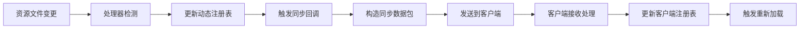

# 网络同步机制技术文档

## 1. 概述

SparkCore 采用双重网络同步策略，确保服务端和客户端的动态资源保持一致。系统支持增量同步和全量同步两种模式，通过高效的数据传输和缓存机制，实现了低延迟、高可靠性的资源同步。

### 1.1 同步架构设计

**基础架构**:
- **增量同步**: 监听资源变更，实时同步单个资源的变化
- **全量同步**: 玩家登录时同步所有动态资源
- **分层同步**: 不同类型的资源采用不同的同步策略
- **缓存机制**: 客户端缓存减少重复传输

### 1.2 同步数据类型

| 数据类型 | 同步方式 | 触发时机 | 数据包类型 |
|---------|---------|---------|-----------|
| 动画数据 | 增量+全量 | 文件变更/玩家登录 | `AnimationDataSyncPayload` |
| 模型数据 | 增量+全量 | 文件变更/玩家登录 | `ModelDataPayload` |
| 纹理数据 | 增量+全量 | 文件变更/玩家登录 | `TextureDataSyncPayload` |
| JavaScript脚本 | 增量+全量 | 文件变更/玩家登录 | `JSScriptDataSyncPayload` |
| 动态注册表 | 增量 | 注册表变更 | `DynamicRegistrySyncS2CPacket` |

## 2. 增量同步机制

### 2.1 DynamicRegistrySyncS2CPacket

**位置**: `cn.solarmoon.spark_core.registry.sync.DynamicRegistrySyncS2CPacket`

```kotlin
class DynamicRegistrySyncS2CPacket(
    val registryKey: ResourceKey<*>,     // 注册表键
    val entryId: ResourceLocation,       // 条目ID
    val operationType: OperationType,    // 操作类型
    val entryData: ByteArray            // 条目数据
)

enum class OperationType {
    CREATE,    // 创建条目
    UPDATE,    // 更新条目
    DELETE     // 删除条目
}
```

### 2.2 增量同步流程



### 2.3 同步回调机制

**位置**: `cn.solarmoon.spark_core.registry.dynamic.DynamicAwareRegistry`

```kotlin
class DynamicAwareRegistry<T: Any> {
    var onDynamicRegister: ((key: ResourceKey<T>, value: T) -> Unit)? = null
    var onDynamicUnregister: ((key: ResourceKey<T>, value: T) -> Unit)? = null
    
    fun registerDynamic(key: ResourceLocation, value: T) {
        // 注册逻辑
        onDynamicRegister?.invoke(resourceKey, value)
    }
    
    fun unregisterDynamic(key: ResourceLocation): Boolean {
        // 取消注册逻辑
        onDynamicUnregister?.invoke(resourceKey, existingValue)
    }
}
```

## 3. 全量同步机制

### 3.1 同步任务系统

**基础接口**: `cn.solarmoon.spark_core.animation.sync.SendingTask`

```kotlin
interface SendingTask {
    fun sendToPlayer(player: ServerPlayer)
    fun isCompleted(): Boolean
    fun cleanup()
}
```

### 3.2 动画数据同步

**位置**: `cn.solarmoon.spark_core.animation.sync.AnimationDataSendingTask`

```kotlin
class AnimationDataSendingTask : SendingTask {
    companion object {
        fun create(): AnimationDataSendingTask {
            val animations = SparkRegistries.TYPED_ANIMATION
                .getDynamicEntries()
                .toMutableMap()
            return AnimationDataSendingTask(animations)
        }
    }
    
    override fun sendToPlayer(player: ServerPlayer) {
        val payload = AnimationDataSyncPayload(animations)
        PacketDistributor.sendToPlayer(player, payload)
    }
}
```

### 3.3 模型数据同步

**位置**: `cn.solarmoon.spark_core.animation.sync.ModelDataSendingTask`

```kotlin
class ModelDataSendingTask : SendingTask {
    companion object {
        fun create(): ModelDataSendingTask {
            val models = SparkRegistries.MODELS
                .getDynamicEntries()
                .toMutableMap()
            return ModelDataSendingTask(models)
        }
    }
    
    override fun sendToPlayer(player: ServerPlayer) {
        val payload = ModelDataPayload(models)
        PacketDistributor.sendToPlayer(player, payload)
    }
}
```

### 3.4 JavaScript脚本同步

**位置**: `cn.solarmoon.spark_core.js.sync.JSScriptDataSendingTask`

```kotlin
class JSScriptDataSendingTask : SendingTask {
    companion object {
        fun create(): JSScriptDataSendingTask {
            val scripts = JSApi.getAllScriptsForSync()
            return JSScriptDataSendingTask(scripts)
        }
    }
    
    override fun sendToPlayer(player: ServerPlayer) {
        val payload = JSScriptDataSyncPayload(scripts)
        PacketDistributor.sendToPlayer(player, payload)
    }
}
```

## 4. 数据包格式设计

### 4.1 动画数据包

```kotlin
data class AnimationDataSyncPayload(
    val animations: LinkedHashMap<ResourceLocation, TypedAnimation>
) : CustomPacketPayload {
    
    companion object {
        val STREAM_CODEC: StreamCodec<ByteBuf, AnimationDataSyncPayload> = 
            StreamCodec.composite(
                ByteBufCodecs.map(LinkedHashMap::of, 
                    ResourceLocation.STREAM_CODEC,
                    TypedAnimation.STREAM_CODEC
                ),
                AnimationDataSyncPayload::animations,
                ::AnimationDataSyncPayload
            )
    }
}
```

### 4.2 模型数据包

```kotlin
data class ModelDataPayload(
    val models: LinkedHashMap<ResourceLocation, OModel>
) : CustomPacketPayload {
    
    companion object {
        val STREAM_CODEC: StreamCodec<ByteBuf, ModelDataPayload> = 
            StreamCodec.composite(
                ByteBufCodecs.map(LinkedHashMap::of,
                    ResourceLocation.STREAM_CODEC,
                    OModel.STREAM_CODEC
                ),
                ModelDataPayload::models,
                ::ModelDataPayload
            )
    }
}
```

### 4.3 JavaScript脚本数据包

```kotlin
data class JSScriptDataSyncPayload(
    val scripts: Map<String, Map<String, String>>
) : CustomPacketPayload {
    
    companion object {
        val STREAM_CODEC: StreamCodec<ByteBuf, JSScriptDataSyncPayload> = 
            StreamCodec.composite(
                ByteBufCodecs.map(HashMap::of,
                    ByteBufCodecs.STRING_UTF8,
                    ByteBufCodecs.map(HashMap::of,
                        ByteBufCodecs.STRING_UTF8,
                        ByteBufCodecs.STRING_UTF8
                    )
                ),
                JSScriptDataSyncPayload::scripts,
                ::JSScriptDataSyncPayload
            )
    }
}
```

## 5. 同步时机控制

### 5.1 玩家登录同步

**事件监听**: `cn.solarmoon.spark_core.customnpc.ServerModEvents`

```kotlin
@SubscribeEvent
fun onPlayerLoggedIn(event: PlayerEvent.PlayerLoggedInEvent) {
    val player = event.entity as ServerPlayer
    
    // 创建同步任务
    val animationTask = AnimationDataSendingTask.create()
    val modelTask = ModelDataSendingTask.create()
    val scriptTask = JSScriptDataSendingTask.create()
    val textureTask = TextureDataSendingTask.create()
    
    // 发送同步数据
    animationTask.sendToPlayer(player)
    modelTask.sendToPlayer(player)
    scriptTask.sendToPlayer(player)
    textureTask.sendToPlayer(player)
}
```

### 5.2 资源变更同步

**热重载服务**: `cn.solarmoon.spark_core.resource.ResHotReloadService`

```kotlin
object ResHotReloadService {
    fun onResourceChanged(resourceType: String, file: Path) {
        when (resourceType) {
            "animations" -> {
                // 动画文件变更
                val handler = DynamicAnimationHandler
                handler.onResourceModified(file)
            }
            "models" -> {
                // 模型文件变更
                val handler = DynamicModelHandler
                handler.onResourceModified(file)
            }
            "scripts" -> {
                // 脚本文件变更
                val handler = DynamicJavaScriptHandler
                handler.onResourceModified(file)
            }
        }
    }
}
```

## 6. 客户端处理机制

### 6.1 数据包接收处理

**动画数据处理**:
```kotlin
@SubscribeEvent
fun onAnimationDataSync(event: AnimationDataSyncPayload) {
    val registry = SparkRegistries.TYPED_ANIMATION
    
    // 清空客户端动态条目
    registry.clearDynamic()
    
    // 重新注册同步的动画
    event.animations.forEach { (key, animation) ->
        registry.registerDynamic(key, animation)
    }
    
    // 触发客户端重新加载
    ClientSparkJS.reloadAll()
}
```

**JavaScript脚本处理**:
```kotlin
@SubscribeEvent
fun onJSScriptDataSync(event: JSScriptDataSyncPayload) {
    // 更新客户端脚本缓存
    JSApi.clientApiCache = event.scripts
    
    // 重新加载脚本
    ClientSparkJS.loadAllFromRegistry()
}
```

### 6.2 缓存管理

**客户端缓存策略**:
```kotlin
object ClientResourceCache {
    private val animationCache = ConcurrentHashMap<ResourceLocation, TypedAnimation>()
    private val modelCache = ConcurrentHashMap<ResourceLocation, OModel>()
    private val scriptCache = ConcurrentHashMap<String, Map<String, String>>()
    
    fun updateAnimationCache(animations: Map<ResourceLocation, TypedAnimation>) {
        animationCache.clear()
        animationCache.putAll(animations)
    }
    
    fun getAnimation(key: ResourceLocation): TypedAnimation? {
        return animationCache[key]
    }
    
    fun clearAllCache() {
        animationCache.clear()
        modelCache.clear()
        scriptCache.clear()
    }
}
```

## 7. 性能优化

### 7.1 数据压缩

**压缩算法**: 使用 Minecraft 内置的 ByteBuf 压缩
```kotlin
fun compressData(data: ByteArray): ByteArray {
    val compressed = ByteArrayOutputStream()
    val deflater = Deflater(Deflater.BEST_COMPRESSION)
    
    try {
        deflater.setInput(data)
        deflater.finish()
        
        val buffer = ByteArray(1024)
        while (!deflater.finished()) {
            val count = deflater.deflate(buffer)
            compressed.write(buffer, 0, count)
        }
    } finally {
        deflater.end()
    }
    
    return compressed.toByteArray()
}
```

### 7.2 批量同步

**批量操作策略**:
```kotlin
class BatchSyncManager {
    private val pendingUpdates = ConcurrentHashMap<ResourceLocation, Any>()
    private val batchTimer = Timer()
    
    fun scheduleBatchSync() {
        batchTimer.schedule(object : TimerTask() {
            override fun run() {
                if (pendingUpdates.isNotEmpty()) {
                    sendBatchUpdate()
                    pendingUpdates.clear()
                }
            }
        }, 100) // 100ms 批量间隔
    }
    
    private fun sendBatchUpdate() {
        val payload = BatchUpdatePayload(pendingUpdates.toMap())
        PacketDistributor.sendToAllPlayers(payload)
    }
}
```

### 7.3 差异同步

**差异计算**:
```kotlin
fun calculateDelta(oldData: Map<ResourceLocation, Any>, 
                  newData: Map<ResourceLocation, Any>): Map<ResourceLocation, Any> {
    val delta = mutableMapOf<ResourceLocation, Any>()
    
    // 查找新增和修改的条目
    newData.forEach { (key, value) ->
        val oldValue = oldData[key]
        if (oldValue == null || !oldValue.equals(value)) {
            delta[key] = value
        }
    }
    
    return delta
}
```

## 8. 错误处理和容错

### 8.1 同步失败处理

**重试机制**:
```kotlin
class SyncRetryManager {
    private val maxRetries = 3
    private val retryDelay = 1000L // 1秒
    
    fun syncWithRetry(player: ServerPlayer, payload: CustomPacketPayload) {
        var attempts = 0
        
        while (attempts < maxRetries) {
            try {
                PacketDistributor.sendToPlayer(player, payload)
                return // 成功发送
            } catch (e: Exception) {
                attempts++
                SparkCore.LOGGER.warn("同步失败，尝试重试 ($attempts/$maxRetries)", e)
                
                if (attempts < maxRetries) {
                    Thread.sleep(retryDelay)
                }
            }
        }
        
        SparkCore.LOGGER.error("同步最终失败，已达到最大重试次数")
    }
}
```

### 8.2 数据完整性验证

**校验机制**:
```kotlin
fun validateSyncData(data: Any): Boolean {
    return when (data) {
        is TypedAnimation -> {
            data.animationId != null && 
            data.animationData != null &&
            data.modelIndex != null
        }
        is OModel -> {
            data.modelId != null &&
            data.bones.isNotEmpty()
        }
        is OJSScript -> {
            data.apiId.isNotEmpty() &&
            data.fileName.isNotEmpty() &&
            data.content.isNotEmpty()
        }
        else -> false
    }
}
```

### 8.3 版本兼容性

**版本检查**:
```kotlin
data class SyncHeader(
    val version: String,
    val timestamp: Long,
    val checksum: String
)

fun validateSyncVersion(header: SyncHeader): Boolean {
    val currentVersion = SparkCore.VERSION
    return header.version == currentVersion
}
```

## 9. 调试和监控

### 9.1 同步日志

**详细日志记录**:
```kotlin
object SyncLogger {
    fun logSyncStart(player: ServerPlayer, dataType: String) {
        SparkCore.LOGGER.info("开始同步 $dataType 到玩家 ${player.name}")
    }
    
    fun logSyncComplete(player: ServerPlayer, dataType: String, size: Int) {
        SparkCore.LOGGER.info("完成同步 $dataType 到玩家 ${player.name}，数据大小: $size")
    }
    
    fun logSyncError(player: ServerPlayer, dataType: String, error: Exception) {
        SparkCore.LOGGER.error("同步 $dataType 到玩家 ${player.name} 失败", error)
    }
}
```

### 9.2 性能监控

**同步性能统计**:
```kotlin
class SyncPerformanceMonitor {
    private val syncTimes = ConcurrentHashMap<String, MutableList<Long>>()
    
    fun recordSyncTime(dataType: String, time: Long) {
        syncTimes.computeIfAbsent(dataType) { mutableListOf() }.add(time)
    }
    
    fun getAverageSyncTime(dataType: String): Double {
        val times = syncTimes[dataType] ?: return 0.0
        return times.average()
    }
    
    fun printStatistics() {
        syncTimes.forEach { (type, times) ->
            val avg = times.average()
            val max = times.maxOrNull() ?: 0
            val min = times.minOrNull() ?: 0
            SparkCore.LOGGER.info("$type 同步统计: 平均=${avg}ms, 最大=${max}ms, 最小=${min}ms")
        }
    }
}
```

## 10. 最佳实践

### 10.1 同步优化建议

1. **减少同步频率**: 使用批量同步减少网络开销
2. **压缩大数据**: 对大型资源使用压缩传输
3. **增量更新**: 只传输变更的数据
4. **缓存策略**: 合理使用客户端缓存
5. **错误处理**: 实现完善的重试和容错机制

### 10.2 开发注意事项

1. **线程安全**: 所有同步操作必须线程安全
2. **内存管理**: 及时清理不需要的缓存数据
3. **版本兼容**: 确保数据格式的向后兼容性
4. **性能监控**: 定期监控同步性能指标
5. **错误日志**: 记录详细的同步错误信息

---

## 总结

SparkCore 的网络同步机制通过双重同步策略、高效的数据传输和完善的错误处理，实现了可靠的客户端-服务端资源同步。系统的模块化设计使得不同类型的资源可以采用最适合的同步策略，在保证数据一致性的同时，最大化了性能表现。

关键特性包括：
- **双重同步**: 增量同步处理实时变更，全量同步确保数据一致
- **高性能**: 批量操作、差异同步、数据压缩等优化措施
- **高可靠**: 重试机制、数据校验、版本兼容性检查
- **易调试**: 详细日志、性能监控、错误追踪

这个网络同步系统为 SparkCore 的动态资源管理提供了坚实的基础，支持大规模、高并发的模组开发需求。