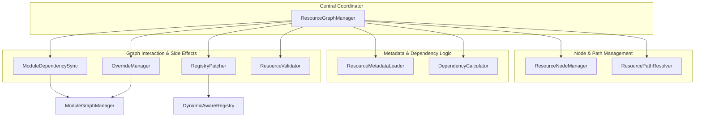

# SparkCore 资源级依赖系统 - 技术文档

## 1. 系统概述

SparkCore 资源级依赖系统已经重构为一个以**图（Graph）**为核心的现代化架构。该系统通过`ResourceGraphManager`作为中央协调器，将复杂的依赖管理、元数据处理、路径解析和覆盖逻辑分解到一系列单一职责的组件中。这种设计不仅提高了系统的可维护性和扩展性，还提供了更强大、更精确的资源管理能力。

### 1.1 设计目标

- **模块化与解耦**: 将庞大的依赖管理逻辑拆分为独立的、可测试的组件。
- **精确的依赖追踪**: 通过有向图精确表示资源间的`HARD_DEPENDENCY`和`SOFT_DEPENDENCY`关系。
- **强大的覆盖系统**: 引入`OVERRIDE`关系，并结合模块优先级解决冲突。
- **自动化与智能化**: 自动计算常规依赖、自动同步模块间依赖。
- **开发者友好**: 提供清晰的API和丰富的调试工具。

### 1.2 核心组件关系图



## 2. 四层目录结构与模块标识

### 2.1 四层目录结构

SparkCore采用四层目录结构来组织资源：`run/sparkcore/{modId}/{moduleName}/{resourceType}/`

**目录层次说明**：
- **第一层**: `run/sparkcore/` - 固定的根目录
- **第二层**: `{modId}` - 模组标识符，对应ResourceLocation的namespace
- **第三层**: `{moduleName}` - 模块名称，用于模组内的模块划分
- **第四层**: `{resourceType}` - 资源类型（animations、models、scripts等）

**示例结构**：
```
run/sparkcore/
├── spark_core/                    # modId: spark_core
│   ├── sparkcore/                 # moduleName: sparkcore
│   │   ├── animations/
│   │   ├── models/
│   │   └── scripts/
│   └── combat/                    # moduleName: combat
│       └── animations/
├── my_mod/                        # modId: my_mod
│   ├── my_mod/                    # moduleName: my_mod
│   │   ├── animations/
│   │   └── models/
│   └── magic_system/              # moduleName: magic_system
│       └── scripts/
```

### 2.2 ResourceLocation格式

资源的唯一标识符遵循格式：`{modId}:{moduleName}/{resourceType}/{path}`

**示例**：
| 物理路径 | ResourceLocation |
|---|---|
| `run/sparkcore/spark_core/sparkcore/animations/player.json` | `spark_core:sparkcore/animations/player` |
| `run/sparkcore/my_mod/magic_system/scripts/fireball.js` | `my_mod:magic_system/scripts/fireball` |
| `run/sparkcore/spark_core/combat/animations/sword_attack.json` | `spark_core:combat/animations/sword_attack` |

### 2.3 模块标识格式

模块使用完整标识符：`{modId}:{moduleName}`

**实现**：
```kotlin
// ResourceNode.getFullModuleId()
fun getFullModuleId(): String = "$modId:$moduleName"

// 示例
"spark_core:sparkcore"    // SparkCore核心模块
"spark_core:combat"       // SparkCore战斗模块
"my_mod:my_mod"          // MyMod主模块
"my_mod:magic_system"    // MyMod魔法系统模块
```

### 2.4 依赖系统中的模块处理

在依赖系统中，模块标识用于：
- **跨模块依赖检测**: 比较源资源和目标资源的`getFullModuleId()`
- **模块依赖同步**: 将资源级依赖提升为模块级依赖
- **覆盖冲突解决**: 基于模块优先级选择覆盖资源

## 3. 核心组件详解

### 2.1 `ResourceGraphManager` - 中央协调器

**位置**: `cn.solarmoon.spark_core.resource.graph.ResourceGraphManager`

**职责**:
- **统一入口**: 提供`addOrUpdateResource`和`removeResource`作为资源图操作的唯一入口。
- **流程编排**: 协调`ResourcePathResolver`, `ResourceMetadataLoader`, `ResourceNodeManager`等组件完成节点的创建和更新。
- **依赖链接**: 触发`DependencyCalculator`和`ModuleDependencySync`来计算和链接依赖关系。
- **信息提供者**: 作为数据源，为`OverrideManager`, `RegistryPatcher`和`ResourceValidator`提供图信息。
- **状态管理**: 持有全局唯一的`SimpleDirectedGraph<ResourceNode, EdgeType>`实例。

### 2.2 `ResourceNodeManager` - 节点管理器

**位置**: `cn.solarmoon.spark_core.resource.graph.ResourceNodeManager`

**职责**:
- **CRUD操作**: 专门负责`ResourceNode`的增、删、改、查。
- **线程安全缓存**: 内部使用`ConcurrentHashMap`提供对资源节点的快速、线程安全的访问。
- **唯一数据源**: 作为所有`ResourceNode`实例的权威存储。

### 2.3 `ResourcePathResolver` - 路径解析器

**位置**: `cn.solarmoon.spark_core.resource.graph.ResourcePathResolver`

**职责**:
- **路径->ID**: 将四层目录结构的物理文件路径（`Path`）转换为逻辑身份（`ResourceLocation`）。
- **四层解析**: 从路径中解析出modId、moduleName、resourceType和资源路径。
- **模块信息提取**: 生成完整的模块标识`{modId}:{moduleName}`。
- **来源判断**: 确定资源来源（松散文件、模组Assets、.spark包等）。
- **缓存**: 缓存解析结果以提高性能。

### 2.4 `ResourceMetadataLoader` - 元数据加载器

**位置**: `cn.solarmoon.spark_core.resource.graph.ResourceMetadataLoader`

**职责**:
- **加载`.meta.json`**: 从文件系统读取并使用`Gson`解析`.meta.json`文件。
- **默认元数据**: 如果元数据文件不存在，会根据文件类型和路径生成一份默认的`OAssetMetadata`。
- **缓存**: 缓存已加载的元数据。

### 2.5 `DependencyCalculator` - 依赖计算器

**位置**: `cn.solarmoon.spark_core.resource.graph.DependencyCalculator`

**职责**:
- **规则驱动**: 内置一系列`DependencyRule`来自动推断依赖。
- **依赖生成**: 根据规则为给定的`ResourceNode`创建`OResourceDependency`列表。
- **图边管理**: 提供`linkDependencies`方法，将计算出的依赖关系作为边（Edge）添加到资源图中。

**示例规则**:
- 动画对同名模型有`HARD_DEPENDENCY`。
- 模型对同名贴图有`SOFT_DEPENDENCY`。
- JS脚本中引用的资源路径被解析为依赖。

### 2.6 `ModuleDependencySync` - 模块依赖同步器

**位置**: `cn.solarmoon.spark_core.resource.graph.ModuleDependencySync`

**职责**:
- **跨模块依赖检测**: 使用`ResourceNode.getFullModuleId()`比较源资源和目标资源的完整模块标识。
- **模块标识提取**: 通过`extractModuleIdFromResourceLocation()`从ResourceLocation获取完整模块ID（格式：`{modId}:{moduleName}`）。
- **同步到模块图**: 检测到跨模块硬依赖时，调用`ModuleGraphManager.addDynamicDependency`建立模块级依赖。
- **依赖清理**: 资源移除时，检查并清理不再需要的模块间动态依赖。
- **性能优化**: 直接从ResourceNode获取模块信息，避免重复解析ResourceLocation。

**核心实现**:
```kotlin
fun syncModuleDependencies(sourceNode: ResourceNode, dependencies: List<OResourceDependency>) {
    val sourceModuleId = sourceNode.getFullModuleId()

    dependencies.forEach { dep ->
        val targetModuleId = extractModuleIdFromResourceLocation(dep.id)

        if (sourceModuleId != targetModuleId && dep.type == ODependencyType.HARD_DEPENDENCY) {
            ModuleGraphManager.addDynamicDependency(sourceModuleId, targetModuleId)
        }
    }
}
```

### 2.7 `OverrideManager` - 覆盖管理器

**位置**: `cn.solarmoon.spark_core.resource.graph.OverrideManager`

**职责**:
- **管理覆盖关系**: 处理资源间的`OVERRIDE`关系。
- **冲突解决**: 当一个资源被多个其他资源覆盖时，通过查询`ModuleGraphManager`获取模块加载顺序（拓扑排序），选择优先级最高的模块所提供的覆盖。
- **缓存**: 缓存已解析的覆盖结果。

### 2.8 `RegistryPatcher` - 注册表补丁器

**位置**: `cn.solarmoon.spark_core.resource.graph.RegistryPatcher`

**职责**:
- **应用覆盖**: 在所有资源和依赖都加载完毕后，调用`applyOverridesToRegistries`。
- **与`OverrideManager`协作**: 获取最终的覆盖“胜者”。
- **修改注册表**: 将原始资源的注册条目（如`spark_core:player_model`）指向覆盖资源的内容。这是实现资源覆盖的最后一步。

### 2.9 `ResourceValidator` - 资源验证器

**位置**: `cn.solarmoon.spark_core.resource.graph.ResourceValidator`

**职责**:
- **依赖验证**: 提供`validateResource`方法来检查一个资源的所有依赖是否都存在于图中。
- **配置化验证**: 支持通过`ValidationConfig`配置验证的严格程度（如是否检查软依赖）。
- **结果缓存**: 缓存验证结果，避免重复计算。

## 3. 图的核心数据结构

### 3.1 `ResourceNode` - 资源节点

**位置**: `cn.solarmoon.spark_core.resource.graph.ResourceNode`

此类是图中顶点的表示，支持四层目录结构。它整合了来自多个旧数据类的信息：
- **逻辑身份**: `id: ResourceLocation` (格式：`{modId}:{moduleName}/{resourceType}/{path}`)
- **元数据**: `provides`, `tags`, `properties` (来自 `OAssetMetadata`)
- **物理路径**: `namespace`, `resourcePath`, `sourceType`, `basePath`, `relativePath` (来自 `ResourcePathInfo`)
- **四层结构支持**: `modId`, `moduleName` (新增字段)
- **模块标识**: `getFullModuleId()` 方法返回 `{modId}:{moduleName}` 格式的完整模块标识

**关键方法**:
```kotlin
fun getFullModuleId(): String = "$modId:$moduleName"
```

**示例**:
```kotlin
val node = ResourceNode(
    id = ResourceLocation("my_mod", "magic_system/scripts/fireball"),
    modId = "my_mod",
    moduleName = "magic_system",
    // ... 其他字段
)
// node.getFullModuleId() 返回 "my_mod:magic_system"
```

### 3.2 `EdgeType` - 边类型

**位置**: `cn.solarmoon.spark_core.resource.graph.EdgeType`

```kotlin
enum class EdgeType {
    HARD_DEPENDENCY, // 硬依赖
    SOFT_DEPENDENCY, // 软依赖
    OVERRIDE         // 覆盖关系
}
```
`EdgeType`清晰地定义了图中节点之间的三种关系，使得图的遍历和分析更加精确。

## 4. 工作流程：深入`addOrUpdateResource`

当一个资源处理器调用`ResourceGraphManager.addOrUpdateResource(filePath, resourceType)`时，内部发生以下流程：

1.  **四层路径解析**: `ResourcePathResolver.resolveResourcePath(filePath, resourceType)`被调用，从四层目录结构中解析：
    -   **ResourceLocation**: 格式为`{modId}:{moduleName}/{resourceType}/{path}`
    -   **模块信息**: 提取`modId`和`moduleName`
    -   **物理路径信息**: 包含`basePath`、`relativePath`等
2.  **元数据加载**: `ResourceMetadataLoader.loadMetadataFor(filePath)`被调用，返回`OAssetMetadata`。
3.  **节点获取/创建**: `ResourceNodeManager.getNode(resourceLocation)`检查节点是否存在。
    -   如果存在，则更新其元数据和模块信息。
    -   如果不存在，则创建包含四层结构信息的新`ResourceNode`，并添加到`ResourceNodeManager`和`graph`中。
4.  **依赖计算与链接**: `generateAndLinkDependencies(node)`被触发。
    -   `DependencyCalculator.calculateDependencies(node)`根据规则计算出依赖列表。
    -   `DependencyCalculator.linkDependencies(graph, node, dependencies)`在图中为这些依赖创建边。
    -   `ModuleDependencySync.syncModuleDependencies(node, dependencies)`使用`node.getFullModuleId()`检查跨模块依赖，并更新`ModuleGraphManager`。

**四层结构示例**:
```
输入路径: run/sparkcore/my_mod/magic_system/scripts/fireball.js
解析结果:
- ResourceLocation: my_mod:magic_system/scripts/fireball
- modId: my_mod
- moduleName: magic_system
- 完整模块标识: my_mod:magic_system
```

## 5. 总结

新的资源依赖系统通过将复杂的逻辑拆分到专门的组件中，实现了高度的内聚和松散的耦合。`ResourceGraphManager`作为这一系统的“大脑”，负责协调各个部分，确保资源从四层目录结构的物理文件到逻辑图节点的转化过程正确无误。

**四层目录结构的优势**:
- **模块化组织**: 通过`{modId}:{moduleName}`实现更精细的模块划分
- **精确依赖追踪**: 基于完整模块标识进行跨模块依赖检测
- **扩展性**: 支持单个mod内的多模块组织，便于大型项目管理
- **向后兼容**: 保持对旧格式的支持，平滑迁移

这种设计不仅使得当前系统更加健壮和可预测，也为未来的功能扩展（如可视化依赖图、更复杂的依赖规则、模块级热重载等）奠定了坚实的基础。四层目录结构的引入进一步增强了系统的模块化能力，为复杂的多mod环境提供了更好的资源管理解决方案。